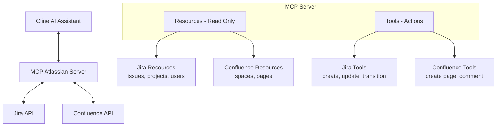
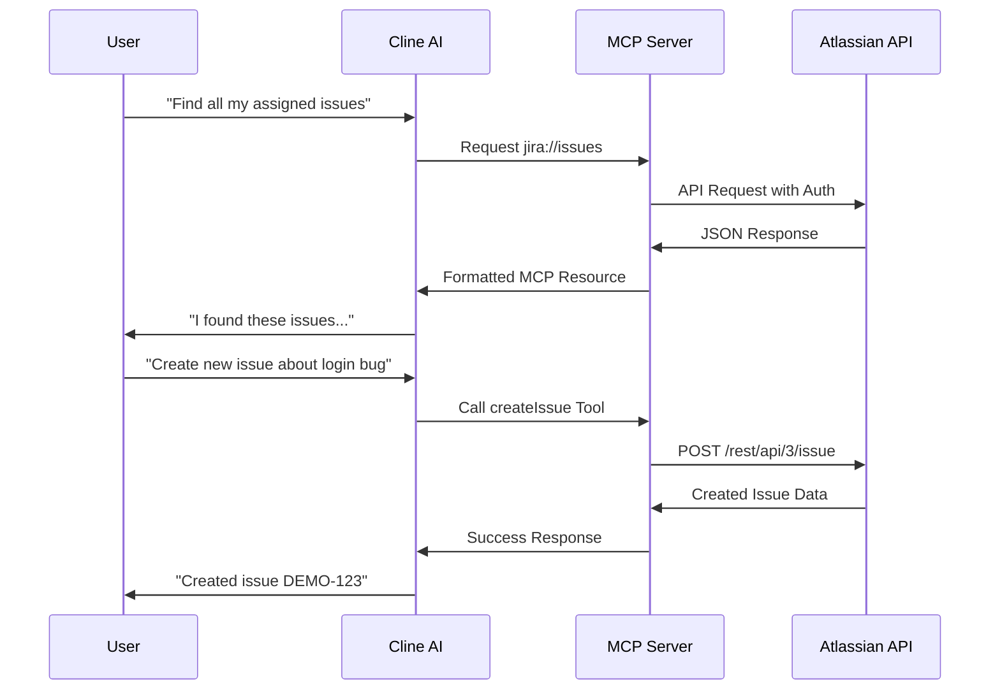

# MCP Atlassian Server (by phuc-nt)

  

## Introduction

**MCP Atlassian Server (by phuc-nt)** is a Model Context Protocol (MCP) server that connects AI agents like Cline, Claude Desktop, or Cursor to Atlassian Jira and Confluence, enabling them to query data and perform actions through a standardized interface.

> **Note:** This server is primarily designed and optimized for use with Cline, though it follows the MCP standard and can work with other MCP-compatible clients.

- **Key Features:**  
  - Connect AI agents to Atlassian Jira and Confluence
  - Support both Resources (read-only) and Tools (actions/mutations)
  - Easy integration with Cline through MCP Marketplace
  - Local-first design for personal development environments
  - Optimized integration with Cline AI assistant

## The Why Behind This Project

As a developer working daily with Jira and Confluence, I found myself spending significant time navigating these tools. While they're powerful, I longed for a simpler way to interact with them without constantly context-switching during deep work.

The emergence of AI Agents and the Model Context Protocol (MCP) presented the perfect opportunity. I immediately saw the potential to connect Jira and Confluence (with plans for Slack, GitHub, Calendar, and more) to my AI workflows.

This project began as a learning journey into MCP and AI Agents, but I hope it evolves into something truly useful for individuals and organizations who interact with Atlassian tools daily.

## System Architecture

## Installation & Setup

For detailed installation and setup instructions, please refer to our [installation guide for AI assistants](./llms-install.md). This guide is specially formatted for AI/LLM assistants like Cline to read and automatically set up the MCP Atlassian Server.

> **Note for Cline users**: The installation guide (llms-install.md) is optimized for Cline AI to understand and execute. You can simply ask Cline to "Install MCP Atlassian Server (by phuc-nt)" and it will be able to parse the instructions and help you set up everything step-by-step.

The guide includes:
- Prerequisites and system requirements
- Step-by-step setup for Node.js environments
- Configuring Cline AI assistant to connect with Atlassian
- Getting and setting up Atlassian API tokens
- Security recommendations and best practices

## Feature Overview

> For detailed documentation of all Resources and Tools, see [Resources & Tools Reference](./docs/introduction/resources-and-tools.md)

| Type      | Group       | Feature                                         | Description                                      | Status |
|-----------|-------------|-------------------------------------------------|--------------------------------------------------|--------|
| Resource  | Jira        | View issues, projects, users, comments, roles   | Query Jira data (JQL, details, lists)            | ✔      |
| Resource  | Jira        | Filters, Boards, Dashboards, Sprints            | Advanced management for developers               | 🚧     |
| Resource  | Confluence  | View spaces, pages, child pages, comments       | Query Confluence data                            | ✔      |
| Resource  | Confluence  | Labels, Attachments, Content Versions           | Advanced document management                     | 🚧     |
| Resource  | Other       | Smart caching, advanced JQL/CQL, templates      | Performance, experience, UI integration          | 🚧     |
| Tool      | Jira        | Create, update, transition issues               | Direct actions on Jira                           | ✔      |
| Tool      | Confluence  | Create pages, comments                          | Direct actions on Confluence                     | ✔      |
| Tool      | Other       | Prompts, Sampling, Personalization              | AI optimization, personalization, advanced flows | 🚧     |

## Request Flow

## Example Use Cases
Try asking Cline these queries after installation:

1. **Create and Manage Tasks**
   - "Create a new issue in project DEMO about login errors"
   - "Find all issues assigned to me in the current sprint"
   - "Transition issue DEMO-43 to Done status"

2. **Project Information Summary**
   - "Summarize all issues in project DEMO"
   - "Who is assigned issues in project DEMO?"
   - "List unassigned issues in the current sprint"

3. **Documentation with Confluence**
   - "Create a Confluence page titled 'Meeting Notes'"
   - "Add a comment to the Confluence page about API Documentation"

4. **Analysis and Reporting**
   - "Compare the number of completed issues between the current and previous sprint"
   - "Who has the most issues in 'To Do' status?"

> These queries work best within the Cline environment, which has been thoroughly tested with this MCP server.

### Usage Notes

1. **Simple JQL**: When searching for issues, use simple JQL without spaces or special characters (e.g., `project=DEMO` instead of `project = DEMO AND key = DEMO-43`).

2. **Create Confluence Page**: When creating a Confluence page, use simple HTML content and do not specify parentId to avoid errors.

3. **Create Issue**: When creating new issues, only provide the minimum required fields (projectKey, summary) for best success.

4. **Access Rights**: Ensure the configured Atlassian account has access to the projects and spaces you want to interact with.

## Security Note

- Your API token inherits all permissions of the user that created it
- Never share your token with a non-trusted party
- Be cautious when asking LLMs to analyze config files containing your token
- See detailed security guidelines in [llms-install.md](./llms-install.md#security-warning-when-using-llms)

## Contribute & Support

- Contribute by opening Pull Requests or Issues on GitHub.
- Join the MCP/Cline community for additional support.

---

**MCP Atlassian Server (by phuc-nt)** is ready for one-click installation from Cline Marketplace!  
**See detailed instructions in [llms-install.md](./llms-install.md)**

> While the server uses the open MCP standard, it is primarily designed and tested for Cline users.