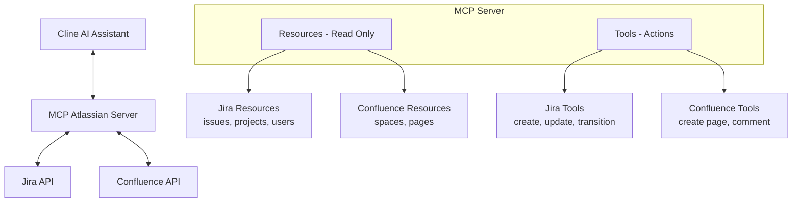
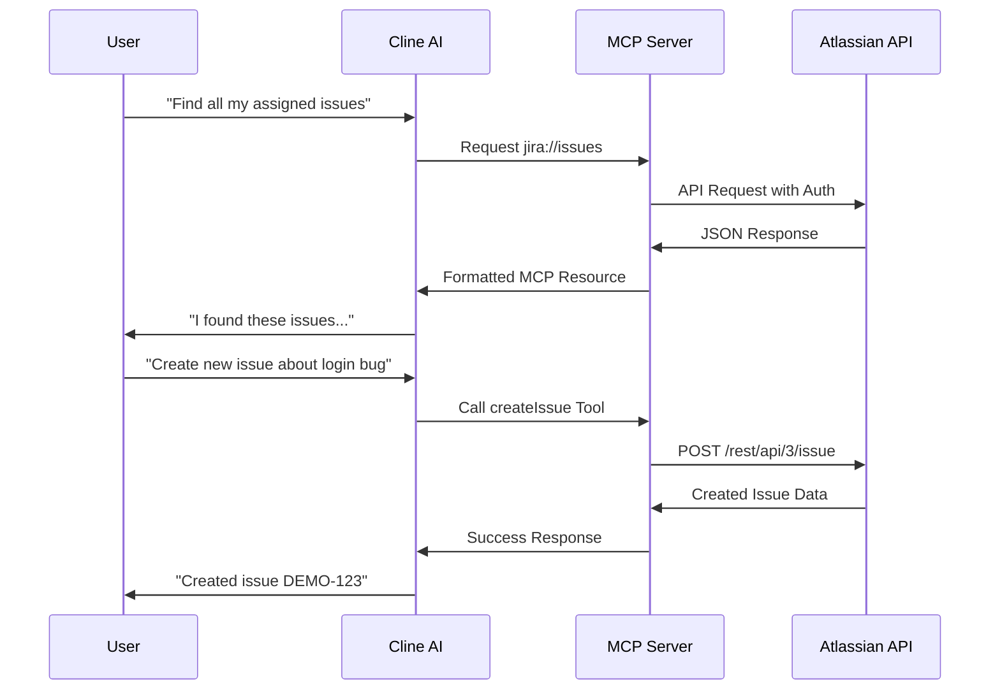

# MCP Atlassian Server (by phuc-nt)

<p align="center">
  
</p>

[](https://github.com/phuc-nt/mcp-atlassian-server)
[](https://smithery.ai/server/@phuc-nt/mcp-atlassian-server)

## Introduction

**MCP Atlassian Server (by phuc-nt)** is a Model Context Protocol (MCP) server that connects AI agents like Cline, Claude Desktop, or Cursor to Atlassian Jira and Confluence, enabling them to query data and perform actions through a standardized interface.

> **Note:** This server is primarily designed and optimized for use with Cline, though it follows the MCP standard and can work with other MCP-compatible clients.


- **Key Features:**  
  - Connect AI agents to Atlassian Jira and Confluence
  - Support both Resources (read-only) and Tools (actions/mutations)
  - Easy integration with Cline through MCP Marketplace
  - Local-first design for personal development environments
  - Optimized integration with Cline AI assistant

## The Why Behind This Project

As a developer working daily with Jira and Confluence, I found myself spending significant time navigating these tools. While they're powerful, I longed for a simpler way to interact with them without constantly context-switching during deep work.

The emergence of AI Agents and the Model Context Protocol (MCP) presented the perfect opportunity. I immediately saw the potential to connect Jira and Confluence (with plans for Slack, GitHub, Calendar, and more) to my AI workflows.

This project began as a learning journey into MCP and AI Agents, but I hope it evolves into something truly useful for individuals and organizations who interact with Atlassian tools daily.

## System Architecture



## Installation & Setup

For detailed installation and setup instructions, please refer to our [installation guide for AI assistants](./llms-install.md). This guide is specially formatted for AI/LLM assistants like Cline to read and automatically set up the MCP Atlassian Server.

> **Note for Cline users**: The installation guide (llms-install.md) is optimized for Cline AI to understand and execute. You can simply ask Cline to "Install MCP Atlassian Server (by phuc-nt)" and it will be able to parse the instructions and help you set up everything step-by-step.

The guide includes:
- Prerequisites and system requirements
- Step-by-step setup for Node.js environments
- Configuring Cline AI assistant to connect with Atlassian
- Getting and setting up Atlassian API tokens
- Security recommendations and best practices

### Installing via Smithery

To install Atlassian Integration Server for Claude Desktop automatically via [Smithery](https://smithery.ai/server/@phuc-nt/mcp-atlassian-server):

```bash
npx -y @smithery/cli install @phuc-nt/mcp-atlassian-server --client claude
```

## Feature Overview

> For complete technical details including actual Atlassian API endpoints and implementation notes, see [Resource & Tools Documentation](./docs/introduction/resources-and-tools.md).

| Type      | Group       | Feature                                         | Description                                      | Status |
|-----------|-------------|-------------------------------------------------|--------------------------------------------------|--------|
| Resource  | Jira        | View issues, projects, users, comments, roles, filters, boards, sprints, dashboards, gadgets | Query Jira data (JQL, details, lists, roles, assignable users, users by role, filters, boards, sprints, dashboards, gadgets) | ✔      |
| Resource  | Confluence  | View spaces, pages, child pages, ancestors, labels, attachments, versions | Query Confluence data (spaces, pages, children, ancestors, labels, attachments, versions) | ✔      |
| Tool      | Jira        | Create, update, transition, assign issues; manage filters, sprints        | Direct actions on Jira (createIssue, updateIssue, transitionIssue, assignIssue, createFilter, updateFilter, deleteFilter, createSprint) | ✔      |
| Tool      | Confluence  | Create, update pages, add comments, manage labels                        | Direct actions on Confluence (createPage, updatePage, addComment, addLabelsToPage, removeLabelsFromPage) | ✔      |
| Tool      | Other       | Prompts, Sampling, Personalization              | AI optimization, personalization, advanced flows | 🚧     |

### Resource Endpoints (Jira & Confluence)

| Resource | URI Pattern | Description |
|----------|-------------|-------------|
| Projects | `jira://projects` | List all Jira projects |
| Project | `jira://projects/{projectKey}` | Project details |
| Project Roles | `jira://projects/{projectKey}/roles` | List project roles |
| Issues | `jira://issues` | List/search issues (JQL, pagination) |
| Issue | `jira://issues/{issueKey}` | Issue details |
| Issue Transitions | `jira://issues/{issueKey}/transitions` | List available transitions |
| Comments | `jira://issues/{issueKey}/comments` | List comments of an issue |
| User | `jira://users/{accountId}` | User details |
| Assignable Users | `jira://users/assignable/{projectKey}` | Users assignable to a project |
| Users by Role | `jira://users/role/{projectKey}/{roleId}` | Users in a project role |
| Filters | `jira://filters` | List all Jira filters |
| Filter Details | `jira://filters/{filterId}` | Filter details |
| My Filters | `jira://filters/my` | My filters |
| Boards | `jira://boards` | List all Jira boards |
| Board Details | `jira://boards/{boardId}` | Board details |
| Board Issues | `jira://boards/{boardId}/issues` | Issues in a board |
| Board Sprints | `jira://boards/{boardId}/sprints` | Sprints in a board |
| Sprint Details | `jira://sprints/{sprintId}` | Sprint details |
| Sprint Issues | `jira://sprints/{sprintId}/issues` | Issues in a sprint |
| Confluence Spaces | `confluence://spaces` | List all Confluence spaces |
| Confluence Space | `confluence://spaces/{spaceKey}` | Space details |
| Confluence Pages | `confluence://pages` | List all pages |
| Confluence Page | `confluence://pages/{pageId}` | Page details |
| Page Children | `confluence://pages/{pageId}/children` | List child pages |
| Page Ancestors | `confluence://pages/{pageId}/ancestors` | List ancestor pages |
| Page Labels | `confluence://pages/{pageId}/labels` | Labels of a page |
| Page Attachments | `confluence://pages/{pageId}/attachments` | Attachments of a page |
| Page Versions | `confluence://pages/{pageId}/versions` | Version history of a page |
| Dashboards | `jira://dashboards` | List all Jira dashboards |
| My Dashboards | `jira://dashboards/my` | List dashboards owned by current user |
| Dashboard Details | `jira://dashboards/{dashboardId}` | Dashboard details |
| Dashboard Gadgets | `jira://dashboards/{dashboardId}/gadgets` | List gadgets of a dashboard |

> For complete technical details including actual Atlassian API endpoints and implementation notes, see [Resource & Tools Documentation](./docs/introduction/resources-and-tools.md).

### Tool Endpoints

| Tool | Description | Main Parameters |
|------|-------------|-----------------|
| createIssue | Create a new Jira issue | projectKey, summary, description... |
| updateIssue | Update a Jira issue | issueKey, summary, description... |
| transitionIssue | Transition issue status | issueKey, transitionId |
| assignIssue | Assign issue to user | issueKey, accountId |
| createFilter | Create a Jira filter | name, jql, description, favourite |
| updateFilter | Update a Jira filter | filterId, name, jql, description, favourite |
| deleteFilter | Delete a Jira filter | filterId |
| createSprint | Create a Jira sprint | boardId, name, startDate, endDate, goal |
| createPage | Create a Confluence page | title, content, spaceKey |
| updatePage | Update a Confluence page | pageId, title, content, version |
| updatePageTitle | Update a Confluence page title | pageId, title, version |
| addComment | Add comment to a page | pageId, content |
| updateFooterComment | Update a footer comment | commentId, version, value, representation, message |
| deleteFooterComment | Delete a footer comment | commentId |
| deletePage | Delete a Confluence page | pageId, draft, purge |
| addIssueToBoard | Add issue(s) to a Jira board | boardId, issueKey |
| configureBoardColumns | Configure columns of a Jira board | boardId, columns |
| startSprint | Start a Jira sprint | sprintId, startDate, endDate, goal |
| closeSprint | Close a Jira sprint | sprintId, completeDate, moveToSprintId, createNewSprint |
| moveIssuesBetweenSprints | Move issues between sprints | fromSprintId, toSprintId, issueKeys |
| addIssuesToBacklog | Add issues to backlog | boardId, issueKeys |
| removeIssuesFromBacklog | Remove issues from backlog (move to sprint) | boardId, sprintId, issueKeys |
| rankBacklogIssues | Rank issues in backlog | boardId, issueKeys, rankBeforeIssue, rankAfterIssue |
| createDashboard | Create a Jira dashboard | name, description, sharePermissions |
| updateDashboard | Update a Jira dashboard | dashboardId, name, description, sharePermissions |
| addGadgetToDashboard | Add gadget to dashboard | dashboardId, uri, color, position, title, properties |
| removeGadgetFromDashboard | Remove gadget from dashboard | dashboardId, gadgetId |

## Request Flow



## Example Use Cases
Try asking Cline these queries after installation:

1. **Create and Manage Tasks**
   - "Create a new issue in project DEMO about login errors"
   - "Find all issues assigned to me in the current sprint"
   - "Transition issue DEMO-43 to Done status"

2. **Project Information Summary**
   - "Summarize all issues in project DEMO"
   - "Who is assigned issues in project DEMO?"
   - "List unassigned issues in the current sprint"

3. **Documentation with Confluence**
   - "Create a Confluence page titled 'Meeting Notes'"
   - "Update the Confluence page 'API Documentation' with new examples"
   - "Change the title of the 'Meeting Notes' page to 'Weekly Meeting Notes'"
   - "Add a comment to the Confluence page about API Documentation"
   - "Update my comment on the API Documentation page"
   - "Delete my comment from the Meeting Notes page" 
   - "Delete the outdated page about last year's project"

4. **Analysis and Reporting**
   - "Compare the number of completed issues between the current and previous sprint"
   - "Who has the most issues in 'To Do' status?"

> These queries work best within the Cline environment, which has been thoroughly tested with this MCP server.

### Usage Notes

1. **Simple JQL**: When searching for issues, use simple JQL without spaces or special characters (e.g., `project=DEMO` instead of `project = DEMO AND key = DEMO-43`).

2. **Create Confluence Page**: When creating a Confluence page, use simple HTML content and do not specify parentId to avoid errors.

3. **Update Confluence Page**: When updating a page, always include the current version number to avoid conflicts. You can also update labels (add/remove) and must use valid storage format for content.

4. **Create Issue**: When creating new issues, only provide the minimum required fields (projectKey, summary) for best success.

5. **Access Rights**: Ensure the configured Atlassian account has access to the projects and spaces you want to interact with.

## Security Note

- Your API token inherits all permissions of the user that created it
- Never share your token with a non-trusted party
- Be cautious when asking LLMs to analyze config files containing your token
- See detailed security guidelines in [llms-install.md](./llms-install.md#security-warning-when-using-llms)

## Contribute & Support

- Contribute by opening Pull Requests or Issues on GitHub.
- Join the MCP/Cline community for additional support.

---

**MCP Atlassian Server (by phuc-nt)** is ready for one-click installation from Cline Marketplace!  
**See detailed instructions in [llms-install.md](./llms-install.md)**

> While the server uses the open MCP standard, it is primarily designed and tested for Cline users.

**Lưu ý:** Từ tháng 6/2025, toàn bộ resource Jira đã migrate sang API v3 (endpoint `/rest/api/3/...`). Các trường rich text như description/comment trả về dạng ADF, đã tự động chuyển sang text thuần cho client không hỗ trợ ADF.

## Confluence API (v2)

Từ tháng 5/2025, MCP Server chỉ hỗ trợ Confluence REST API v2 (`/wiki/api/v2/`).

- Tất cả resource và tool Confluence đã migrate sang API v2.
- Không còn sử dụng endpoint `/rest/api/`.
- Schema dữ liệu đã cập nhật theo API v2 (xem chi tiết trong docs/dev-guide/confluence-migrate-to-v2.md).

> **Lưu ý:** Nếu bạn còn sử dụng API v1, cần migrate ngay để tránh gián đoạn dịch vụ.
