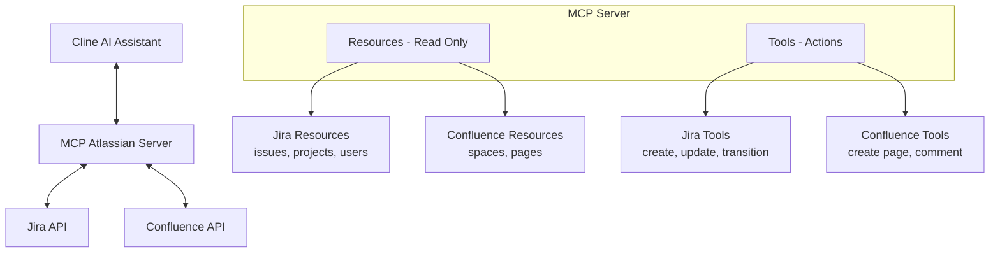
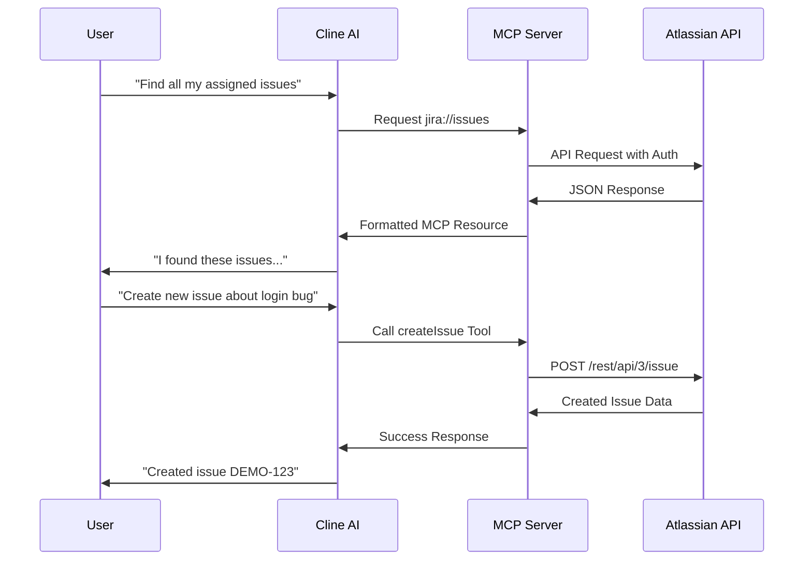

# MCP Atlassian Server (by phuc-nt)

<p align="center">
  
</p>

[](https://github.com/phuc-nt/mcp-atlassian-server)
[](https://smithery.ai/server/@phuc-nt/mcp-atlassian-server)

## What's New in Version 2.1.0 🚀

- Refactored the entire codebase to standardize resource/tool structure, completely removed the content-metadata resource, and merged metadata into the page resource.
- New developer guide: anyone can now easily extend and maintain the codebase.
- Ensured compatibility with the latest MCP SDK, improved security, scalability, and maintainability.
- Updated `docs/introduction/resources-and-tools.md` to remove all references to content-metadata.

👉 **See the full [CHANGELOG](./CHANGELOG.md) for details.**

## What's New in Version 2.0.1 🎉

**MCP Atlassian Server v2.0.1** brings a major expansion of features and capabilities!

- **Updated APIs**: Now using the latest Atlassian APIs (Jira API v3, Confluence API v2)
- **Expanded Features**: Grown from 21 to 48 features, including advanced Jira and Confluence capabilities
- **Enhanced Board & Sprint Management**: Complete Agile/Scrum workflow support
- **Advanced Confluence Features**: Page version management, attachments handling, and comment management
- **Improved Resource Registration**: Fixed duplicate resource registration issues for a more stable experience
- **Documentation Update**: New comprehensive documentation series explaining MCP architecture, resource/tool development

For full details on all changes, improvements, and fixes, see the [CHANGELOG](./CHANGELOG.md).

## Introduction

**MCP Atlassian Server (by phuc-nt)** is a Model Context Protocol (MCP) server that connects AI agents like Cline, Claude Desktop, or Cursor to Atlassian Jira and Confluence, enabling them to query data and perform actions through a standardized interface.

> **Note:** This server is primarily designed and optimized for use with Cline, though it follows the MCP standard and can work with other MCP-compatible clients.


- **Key Features:**  
  - Connect AI agents to Atlassian Jira and Confluence
  - Support both Resources (read-only) and Tools (actions/mutations)
  - Easy integration with Cline through MCP Marketplace
  - Local-first design for personal development environments
  - Optimized integration with Cline AI assistant

## The Why Behind This Project

As a developer working daily with Jira and Confluence, I found myself spending significant time navigating these tools. While they're powerful, I longed for a simpler way to interact with them without constantly context-switching during deep work.

The emergence of AI Agents and the Model Context Protocol (MCP) presented the perfect opportunity. I immediately saw the potential to connect Jira and Confluence (with plans for Slack, GitHub, Calendar, and more) to my AI workflows.

This project began as a learning journey into MCP and AI Agents, but I hope it evolves into something truly useful for individuals and organizations who interact with Atlassian tools daily.

## System Architecture



## Installation & Setup

For detailed installation and setup instructions, please refer to our [installation guide for AI assistants](./llms-install.md). This guide is specially formatted for AI/LLM assistants like Cline to read and automatically set up the MCP Atlassian Server.

> **Note for Cline users**: The installation guide (llms-install.md) is optimized for Cline AI to understand and execute. You can simply ask Cline to "Install MCP Atlassian Server (by phuc-nt)" and it will be able to parse the instructions and help you set up everything step-by-step.

The guide includes:
- Prerequisites and system requirements
- Step-by-step setup for Node.js environments
- Configuring Cline AI assistant to connect with Atlassian
- Getting and setting up Atlassian API tokens
- Security recommendations and best practices

### Installing via Smithery

To install Atlassian Integration Server for Claude Desktop automatically via [Smithery](https://smithery.ai/server/@phuc-nt/mcp-atlassian-server):

```bash
npx -y @smithery/cli install @phuc-nt/mcp-atlassian-server --client claude
```

## Feature Overview

MCP Atlassian Server enables AI assistants (like Cline, Claude Desktop, Cursor...) to access and manage Jira & Confluence with a full set of features, grouped for clarity:

### Jira

- **Issue Management**
  - View, search, and filter issues
  - Create, update, transition, and assign issues
  - Add issues to backlog or sprint, rank issues

- **Project Management**
  - View project list, project details, and project roles

- **Board & Sprint Management**
  - View boards, board configuration, issues and sprints on boards
  - Create, start, and close sprints

- **Filter Management**
  - View, create, update, and delete filters

- **Dashboard & Gadget Management**
  - View dashboards and gadgets
  - Create and update dashboards
  - Add or remove gadgets on dashboards

- **User Management**
  - View user details, assignable users, and users by project role

### Confluence

- **Space Management**
  - View space list, space details, and pages in a space

- **Page Management**
  - View, search, and get details of pages, child pages, ancestors, attachments, and version history
  - Create, update, rename, and delete pages

- **Comment Management**
  - View, add, update, and delete comments on pages


> For a full technical breakdown of all features, resources, and tools, see:
> [docs/introduction/resources-and-tools.md](./docs/introduction/resources-and-tools.md)

---

## Request Flow



## Security Note

- Your API token inherits all permissions of the user that created it
- Never share your token with a non-trusted party
- Be cautious when asking LLMs to analyze config files containing your token
- See detailed security guidelines in [llms-install.md](./llms-install.md#security-warning-when-using-llms)

## Contribute & Support

- Contribute by opening Pull Requests or Issues on GitHub.
- Join the MCP/Cline community for additional support.