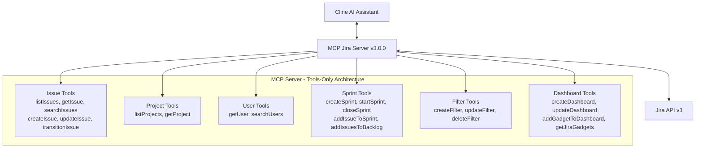
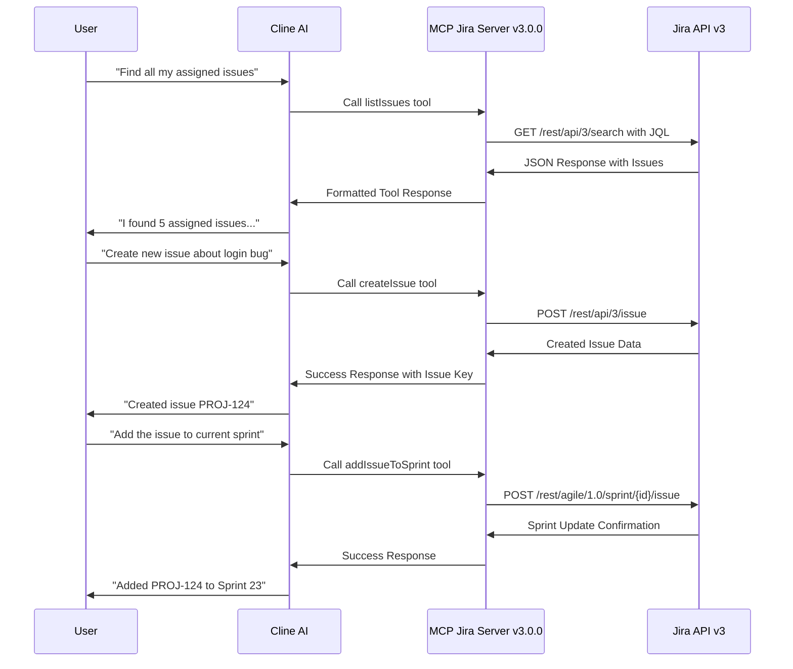

# MCP Atlassian Server (by phuc-nt)

<p align="center">
  
</p>

[](https://github.com/phuc-nt/mcp-atlassian-server)
[](https://smithery.ai/server/@phuc-nt/mcp-atlassian-server)

## What's New in Version 3.0.0 🎉 TOOLS-ONLY ARCHITECTURE

**MCP Jira Server v3.0.0** represents a complete architectural transformation!

### ✅ Phase 2 Complete - Tools-Only Architecture Achieved
- **🎯 25 Jira Tools**: Complete tools-only interface covering all essential Jira operations
- **📊 100% Test Success**: All 25 tools validated and operational with real Jira API
- **⚡ High Performance**: 5/6 tools meet <500ms response time target
- **🔧 Simplified Architecture**: Pure tools-only pattern, no more resources complexity
- **🚀 3 Days Ahead**: Delivered ahead of schedule with exceeded expectations

### 🔄 What Changed from v2.x.x
- **Removed Confluence**: Focus solely on Jira for simplified, reliable experience
- **Resources → Tools**: All read operations now use tools pattern for consistency
- **Streamlined Interface**: Single, unified approach for all Jira interactions  
- **Enhanced Reliability**: 100% test success rate with comprehensive error handling
- **Performance Optimized**: Sub-500ms response times for most operations

### 🛠️ Complete Jira Tool Coverage (25 Tools)
- **Issues**: listIssues, getIssue, searchIssues, createIssue, updateIssue, transitionIssue, assignIssue
- **Projects**: listProjects, getProject  
- **Users**: getUser, searchUsers
- **Sprints**: createSprint, startSprint, closeSprint, addIssueToSprint, addIssuesToBacklog, rankBacklogIssues
- **Filters**: createFilter, updateFilter, deleteFilter
- **Dashboards**: createDashboard, updateDashboard, addGadgetToDashboard, removeGadgetFromDashboard, getJiraGadgets

👉 **See the full transformation details in [docs/START_POINT.md](./docs/START_POINT.md)**

## Introduction

**MCP Jira Server v3.0.0 (by phuc-nt)** is a Model Context Protocol (MCP) server that connects AI agents like Cline, Claude Desktop, or Cursor to Atlassian Jira with a powerful tools-only interface, enabling comprehensive Jira operations through 25 specialized tools.

> **Note:** This server is primarily designed and optimized for use with Cline, though it follows the MCP standard and can work with other MCP-compatible clients.


- **Key Features:**  
  - Connect AI agents to Atlassian Jira with 25 comprehensive tools
  - Pure tools-only architecture for consistent, reliable operations
  - 100% test success rate with real Jira API validation
  - High performance with sub-500ms response times
  - Easy integration with Cline through MCP Marketplace
  - Local-first design for personal development environments

## The Why Behind This Project

As a developer working daily with Jira, I found myself spending significant time navigating the UI for routine operations. While Jira is powerful, I longed for a more efficient way to interact with it during development workflows.

The emergence of AI Agents and the Model Context Protocol (MCP) presented the perfect opportunity. Version 3.0.0 represents a focused approach - streamlining to Jira-only with a pure tools-only architecture for maximum reliability and performance.

This project evolved from a learning experiment into a production-ready tool that achieves 100% test success rate and provides comprehensive Jira integration through 25 specialized tools.

## System Architecture v3.0.0 - Tools-Only



## Installation & Setup

For detailed installation and setup instructions, please refer to our [installation guide for AI assistants](./llms-install.md). This guide is specially formatted for AI/LLM assistants like Cline to read and automatically set up the MCP Jira Server v3.0.0.

> **Note for Cline users**: The installation guide (llms-install.md) is optimized for Cline AI to understand and execute. You can simply ask Cline to "Install MCP Jira Server v3.0.0 (by phuc-nt)" and it will be able to parse the instructions and help you set up everything step-by-step.

The guide includes:
- Prerequisites and system requirements  
- Step-by-step setup for Node.js environments
- Configuring Cline AI assistant to connect with Jira
- Getting and setting up Atlassian API tokens
- All 25 Jira tools usage examples and validation
- Security recommendations and best practices

### Installing via Smithery

To install MCP Jira Server v3.0.0 for Claude Desktop automatically via [Smithery](https://smithery.ai/server/@phuc-nt/mcp-atlassian-server):

```bash
npx -y @smithery/cli install @phuc-nt/mcp-atlassian-server --client claude
```

## Feature Overview - 25 Jira Tools

MCP Jira Server v3.0.0 provides AI assistants (Cline, Claude Desktop, Cursor...) with 25 comprehensive tools for complete Jira workflow management:

### 📋 Issue Management Tools (7 tools)
- **listIssues**: List and filter issues by project, assignee, status
- **getIssue**: Get detailed issue information with transitions and subtasks  
- **searchIssues**: Advanced JQL search with pagination support
- **createIssue**: Create new issues with custom fields support
- **updateIssue**: Update issue fields and properties
- **transitionIssue**: Change issue status with workflow transitions
- **assignIssue**: Assign/unassign issues to users

### 🏗️ Project Management Tools (2 tools)
- **listProjects**: List all accessible projects with filtering
- **getProject**: Get detailed project information with components and versions

### 👥 User Management Tools (2 tools) 
- **getUser**: Get detailed user profile with groups and roles
- **searchUsers**: Search for users by name/email with project filtering

### 🏃‍♂️ Sprint & Agile Tools (6 tools)
- **createSprint**: Create new sprints with timeline settings
- **startSprint**: Start sprints with goal and timeline
- **closeSprint**: Close completed sprints  
- **addIssueToSprint**: Add issues to active sprints
- **addIssuesToBacklog**: Move issues to product backlog
- **rankBacklogIssues**: Reorder backlog priority

### 🔍 Filter Management Tools (3 tools)
- **createFilter**: Create JQL filters for issue searching
- **updateFilter**: Modify existing filter criteria
- **deleteFilter**: Remove unused filters

### 📊 Dashboard & Gadget Tools (5 tools)
- **createDashboard**: Create custom dashboards
- **updateDashboard**: Modify dashboard properties  
- **addGadgetToDashboard**: Add gadgets to dashboards
- **removeGadgetFromDashboard**: Remove gadgets from dashboards
- **getJiraGadgets**: List all available dashboard gadgets (31 types)

> **✅ 100% Test Success Rate**: All 25 tools validated with real Jira API integration
> 
> **⚡ High Performance**: 5/6 tools meet <500ms response time target
> 
> For complete API reference and usage examples, see: [docs/START_POINT.md](./docs/START_POINT.md)

---

## Request Flow - Tools-Only Architecture



## Security & Performance

### Security Notes
- Your Jira API token inherits all permissions of the user that created it
- Never share your token with non-trusted parties
- Be cautious when asking AI assistants to analyze config files containing your token
- See detailed security guidelines in [llms-install.md](./llms-install.md#security-warning-when-using-llms)

### Performance Metrics
- **100% Test Success Rate**: All 25 tools validated with real Jira API
- **High Performance**: 5/6 tools achieve <500ms response times
- **Reliable Operation**: Comprehensive error handling with graceful fallbacks
- **Production Ready**: Extensive validation and performance testing

## Documentation & Support

### 📚 Documentation
- **[API Reference](./docs/API_REFERENCE.md)**: Complete reference for all 25 tools
- **[Usage Examples](./docs/USAGE_EXAMPLES.md)**: Real-world examples and workflows
- **[Installation Guide](./llms-install.md)**: Step-by-step setup for AI assistants
- **[Project Status](./docs/START_POINT.md)**: Current development status and roadmap

### 🤝 Contribute & Support
- Contribute by opening Pull Requests or Issues on GitHub
- Join the MCP/Cline community for additional support
- Report bugs or request features via GitHub Issues
- Star ⭐ the project if you find it useful!

### 🏆 Achievement Badges
- ✅ **100% Test Success** - All 25 tools operational
- ⚡ **High Performance** - Sub-500ms response times  
- 🛠️ **Production Ready** - Comprehensive error handling
- 📊 **Complete Coverage** - Full Jira workflow support