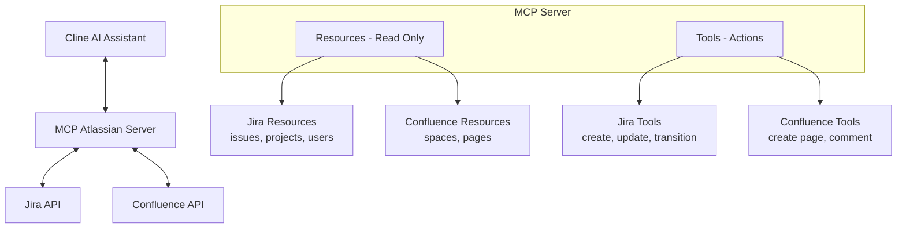
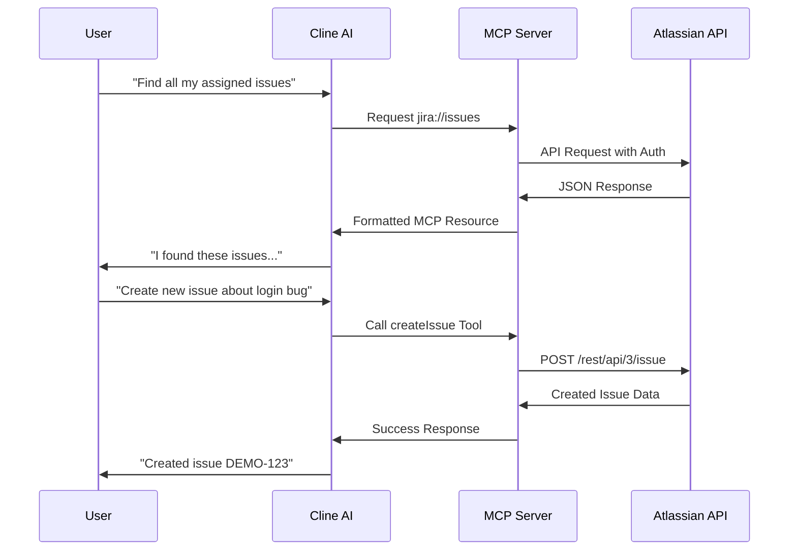

# MCP Atlassian Server (by phuc-nt)

[](https://github.com/phuc-nt/mcp-atlassian-server)

## Introduction

**MCP Atlassian Server (by phuc-nt)** is a Model Context Protocol (MCP) server that connects AI agents like Cline, Claude Desktop, or Cursor to Atlassian Jira and Confluence, enabling them to query data and perform actions through a standardized interface.

> **Note:** This server is primarily designed and optimized for use with Cline, though it follows the MCP standard and can work with other MCP-compatible clients.

- **Key Features:**  
  - Connect AI agents to Atlassian Jira and Confluence
  - Support both Resources (read-only) and Tools (actions/mutations)
  - Easy integration with Cline through MCP Marketplace
  - Local-first design for personal development environments
  - Optimized integration with Cline AI assistant

## The Why Behind This Project

As a developer working daily with Jira and Confluence, I found myself spending significant time navigating these tools. While they're powerful, I longed for a simpler way to interact with them without constantly context-switching during deep work.

The emergence of AI Agents and the Model Context Protocol (MCP) presented the perfect opportunity. I immediately saw the potential to connect Jira and Confluence (with plans for Slack, GitHub, Calendar, and more) to my AI workflows.

This project began as a learning journey into MCP and AI Agents, but I hope it evolves into something truly useful for individuals and organizations who interact with Atlassian tools daily.

## System Architecture



## One-Click Installation

MCP Atlassian Server (by phuc-nt) is available for one-click installation directly from Cline Marketplace!

In Cline, simply type:
```
Install MCP Atlassian Server (by phuc-nt)
```

And follow the configuration prompts.

## Marketplace Installation (Recommended)

1. Open Cline AI assistant
2. Type: "Install MCP Atlassian Server (by phuc-nt) from marketplace"
3. Follow the on-screen configuration prompts
4. Enter your Atlassian site name, email, and API token

That's it! The server will be automatically configured and ready to use.

> **For detailed instructions, see [llms-install.md](./llms-install.md)**

## System Requirements

- Node.js 16+ and npm
- Git
- Atlassian Cloud account and API token with appropriate permissions
- Cline AI assistant (primary supported client)

## Quick Setup

```bash
git clone https://github.com/phuc-nt/mcp-atlassian-server.git
cd mcp-atlassian-server
npm install
npm run build
```

### Node.js Configuration

Configure Cline connection (add to `cline_mcp_settings.json`):

```json
{
  "mcpServers": {
    "mcp-atlassian-server": {
      "disabled": false,
      "timeout": 60,
      "command": "node",
      "args": [
        "/full/path/to/mcp-atlassian-server/dist/index.js"
      ],
      "env": {
        "ATLASSIAN_SITE_NAME": "your-site.atlassian.net",
        "ATLASSIAN_USER_EMAIL": "your-email@example.com",
        "ATLASSIAN_API_TOKEN": "your-api-token"
      },
      "transportType": "stdio"
    }
  }
}
```

## Resources & Tools Available

### Resources (Read-only)
- **Jira**: Issues, Projects, Users, Comments, Transitions
- **Confluence**: Spaces, Pages

### Tools (Actions)
- **Jira**: Create Issue, Update Issue, Transition Issue, Assign Issue
- **Confluence**: Create Page, Add Comment

## Request Flow



## Key Capabilities

### Jira Capabilities
- **Query Data**: View issues, projects, users, and search with JQL
- **Perform Actions**: Create issues, update content, transition states, assign issues

### Confluence Capabilities
- **Content Management**: Create pages with simple HTML content
- **Collaboration**: Add comments to Confluence pages

### Example Use Cases
Try asking Cline these queries after installation:

1. **Create and Manage Tasks**
   - "Create a new issue in project DEMO about login errors"
   - "Find all issues assigned to me in the current sprint"
   - "Transition issue DEMO-43 to Done status"

2. **Project Information Summary**
   - "Summarize all issues in project DEMO"
   - "Who is assigned issues in project DEMO?"
   - "List unassigned issues in the current sprint"

3. **Documentation with Confluence**
   - "Create a Confluence page titled 'Meeting Notes'"
   - "Add a comment to the Confluence page about API Documentation"

4. **Analysis and Reporting**
   - "Compare the number of completed issues between the current and previous sprint"
   - "Who has the most issues in 'To Do' status?"

> These queries work best within the Cline environment, which has been thoroughly tested with this MCP server.

### Usage Notes

1. **Simple JQL**: When searching for issues, use simple JQL without spaces or special characters (e.g., `project=DEMO` instead of `project = DEMO AND key = DEMO-43`).

2. **Create Confluence Page**: When creating a Confluence page, use simple HTML content and do not specify parentId to avoid errors.

3. **Create Issue**: When creating new issues, only provide the minimum required fields (projectKey, summary) for best success.

4. **Access Rights**: Ensure the configured Atlassian account has access to the projects and spaces you want to interact with.

## Security Note

- Your API token inherits all permissions of the user that created it
- Never share your token with a non-trusted party
- Be cautious when asking LLMs to analyze config files containing your token
- See detailed security guidelines in [llms-install.md](./llms-install.md#security-warning-when-using-llms)

## Troubleshooting

If you experience connection issues:

1. Check server logs for errors
2. Test Atlassian API connection:
   ```bash
   curl -u "your-email@example.com:your-api-token" -H "Content-Type: application/json" https://your-site.atlassian.net/rest/api/3/project
   ```

## Detailed Documentation & Notes

- See [llms-install.md](./llms-install.md) for detailed setup instructions for Git, Node.js, and Cline configuration.
- Ensure your Atlassian API token has sufficient permissions.  
  - See "API Token Permissions Note" in [llms-install.md](./llms-install.md).
- Be aware of security implications when using LLMs with configuration files containing tokens.
- If you encounter permission errors, verify the permissions of the user who created the token.

## Contribute & Support

- Contribute by opening Pull Requests or Issues on GitHub.
- Join the MCP/Cline community for additional support.

---

**MCP Atlassian Server (by phuc-nt)** is ready for one-click installation from Cline Marketplace!  
**See detailed instructions in [llms-install.md](./llms-install.md)**

> While the server uses the open MCP standard, it is primarily designed and tested for Cline users.