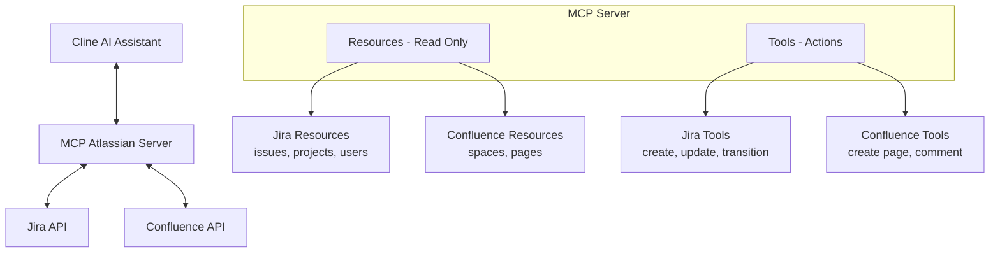
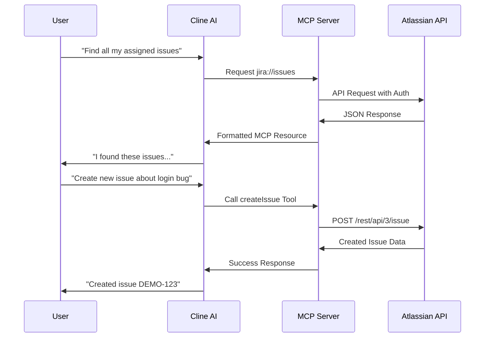

# MCP Atlassian Server (by phuc-nt)

<p align="center">
  
</p>

[](https://github.com/phuc-nt/mcp-atlassian-server)
[](https://smithery.ai/server/@phuc-nt/mcp-atlassian-server)

## Introduction

**MCP Atlassian Server (by phuc-nt)** is a Model Context Protocol (MCP) server that connects AI agents like Cline, Claude Desktop, or Cursor to Atlassian Jira and Confluence, enabling them to query data and perform actions through a standardized interface.

> **Note:** This server is primarily designed and optimized for use with Cline, though it follows the MCP standard and can work with other MCP-compatible clients.


- **Key Features:**  
  - Connect AI agents to Atlassian Jira and Confluence
  - Support both Resources (read-only) and Tools (actions/mutations)
  - Easy integration with Cline through MCP Marketplace
  - Local-first design for personal development environments
  - Optimized integration with Cline AI assistant

## The Why Behind This Project

As a developer working daily with Jira and Confluence, I found myself spending significant time navigating these tools. While they're powerful, I longed for a simpler way to interact with them without constantly context-switching during deep work.

The emergence of AI Agents and the Model Context Protocol (MCP) presented the perfect opportunity. I immediately saw the potential to connect Jira and Confluence (with plans for Slack, GitHub, Calendar, and more) to my AI workflows.

This project began as a learning journey into MCP and AI Agents, but I hope it evolves into something truly useful for individuals and organizations who interact with Atlassian tools daily.

## System Architecture



## Installation & Setup

For detailed installation and setup instructions, please refer to our [installation guide for AI assistants](./llms-install.md). This guide is specially formatted for AI/LLM assistants like Cline to read and automatically set up the MCP Atlassian Server.

> **Note for Cline users**: The installation guide (llms-install.md) is optimized for Cline AI to understand and execute. You can simply ask Cline to "Install MCP Atlassian Server (by phuc-nt)" and it will be able to parse the instructions and help you set up everything step-by-step.

The guide includes:
- Prerequisites and system requirements
- Step-by-step setup for Node.js environments
- Configuring Cline AI assistant to connect with Atlassian
- Getting and setting up Atlassian API tokens
- Security recommendations and best practices

### Installing via Smithery

To install Atlassian Integration Server for Claude Desktop automatically via [Smithery](https://smithery.ai/server/@phuc-nt/mcp-atlassian-server):

```bash
npx -y @smithery/cli install @phuc-nt/mcp-atlassian-server --client claude
```

## Feature Overview

MCP Atlassian Server enables AI assistants (like Cline, Claude Desktop, Cursor...) to access and manage Jira & Confluence with a full set of features, grouped for clarity:

### Jira

- **Issue Management**
  - View, search, and filter issues
  - Create, update, transition, and assign issues
  - Add issues to backlog or sprint, rank issues

- **Project Management**
  - View project list, project details, and project roles

- **Board & Sprint Management**
  - View boards, board configuration, issues and sprints on boards
  - Create, start, and close sprints

- **Filter Management**
  - View, create, update, and delete filters

- **Dashboard & Gadget Management**
  - View dashboards and gadgets
  - Create and update dashboards
  - Add or remove gadgets on dashboards

- **User Management**
  - View user details, assignable users, and users by project role

### Confluence

- **Space Management**
  - View space list, space details, and pages in a space

- **Page Management**
  - View, search, and get details of pages, child pages, ancestors, attachments, and version history
  - Create, update, rename, and delete pages

- **Comment Management**
  - View, add, update, and delete comments on pages

---

> For a full technical breakdown of all features, resources, and tools, see:
> [docs/introduction/resources-and-tools.md](./docs/introduction/resources-and-tools.md)

---

## Example Use Cases

You can try these queries with Cline or any compatible AI assistant:

### Jira

- **Create and manage tasks**
  - "Create a new issue in project DEMO about login errors"
  - "Update the description of issue DEMO-123"
  - "Transition issue DEMO-43 to Done"
  - "Assign issue DEMO-99 to me"
  - "Add issue DEMO-100 to the current sprint"
  - "Reorder issues in the backlog"

- **Project insights**
  - "List all issues in project DEMO"
  - "Who is assigned to issues in project DEMO?"
  - "Show unassigned issues in the current sprint"
  - "Show the configuration of the Kanban board for team X"

- **Dashboard & filter management**
  - "Create a new dashboard for the team"
  - "Add a report gadget to the dashboard"
  - "Create a filter for high-priority issues"

### Confluence

- **Documentation management**
  - "Create a new page in space TEAM X titled 'Project Plan'"
  - "Update the content of the page 'API Documentation'"
  - "Rename the page 'Meeting Notes' to 'Weekly Meeting Notes'"
  - "Delete the old page about last year's project"

- **Collaboration & comments**
  - "Add a comment to the page 'API Documentation'"
  - "Update my comment on the page 'Meeting Notes'"
  - "Delete a comment from the page 'Meeting Notes'"

---

For more details and advanced usage, see [docs/introduction/resources-and-tools.md](./docs/introduction/resources-and-tools.md).

## Request Flow



## Security Note

- Your API token inherits all permissions of the user that created it
- Never share your token with a non-trusted party
- Be cautious when asking LLMs to analyze config files containing your token
- See detailed security guidelines in [llms-install.md](./llms-install.md#security-warning-when-using-llms)

## Contribute & Support

- Contribute by opening Pull Requests or Issues on GitHub.
- Join the MCP/Cline community for additional support.

---

**MCP Atlassian Server (by phuc-nt)** is ready for one-click installation from Cline Marketplace!  
**See detailed instructions in [llms-install.md](./llms-install.md)**

> While the server uses the open MCP standard, it is primarily designed and tested for Cline users.

**Lưu ý:** Từ tháng 6/2025, toàn bộ resource Jira đã migrate sang API v3 (endpoint `/rest/api/3/...`). Các trường rich text như description/comment trả về dạng ADF, đã tự động chuyển sang text thuần cho client không hỗ trợ ADF.

## Codebase Refactoring (July 2023)

Codebase đã được refactor để dễ dàng bảo trì và mở rộng:

- File lớn `src/utils/atlassian-api.ts` đã được tách thành các module nhỏ theo chức năng:
  - `atlassian-api-base.ts`: Helper chung, authentication, logging
  - `confluence-resource-api.ts` & `confluence-tool-api.ts`: API Confluence
  - `jira-resource-api.ts`: API Jira Resource (read-only)
  - `jira-tool-api-v3.ts`: API Jira Tool cho endpoint `/rest/api/3`
  - `jira-tool-api-agile.ts`: API Jira Tool cho endpoint `/rest/agile/1.0`

- Nguyên tắc phân chia:
  - Base Helper: chứa các hàm dùng chung
  - Resource API (read-only): tách riêng cho Jira & Confluence
  - Tool API (mutations): tách riêng cho Jira & Confluence, và tách thêm theo endpoint

> **Dành cho Developers:** Xem hướng dẫn chi tiết về cách maintain, thêm mới resource và tool tại [Resource & Tools Documentation](./docs/introduction/resources-and-tools.md#hướng-dẫn-sau-refactoring).

## Confluence API (v2)

Từ tháng 5/2025, MCP Server chỉ hỗ trợ Confluence REST API v2 (`/wiki/api/v2/`).

- Tất cả resource và tool Confluence đã migrate sang API v2.
- Không còn sử dụng endpoint `/rest/api/`.
- Schema dữ liệu đã cập nhật theo API v2 (xem chi tiết trong docs/dev-guide/confluence-migrate-to-v2.md).

> **Lưu ý:** Nếu bạn còn sử dụng API v1, cần migrate ngay để tránh gián đoạn dịch vụ.
