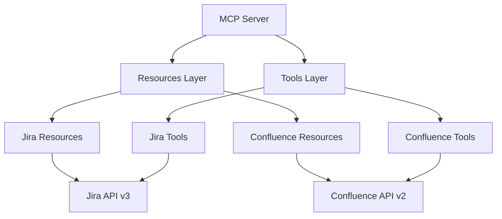
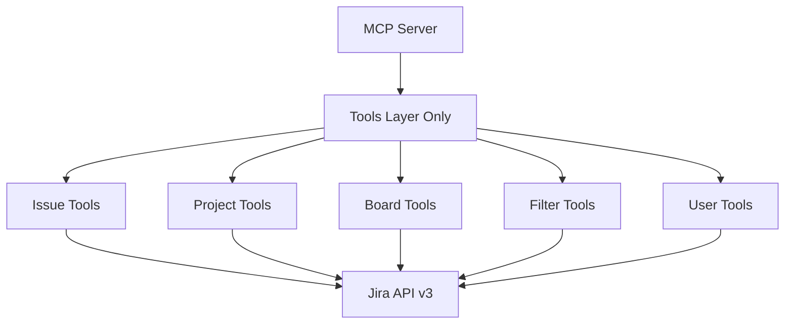

# MCP Jira Server - Implementation Details

> **Target Version**: 3.0.0 (Tools-Only, Jira-Focused)  
> **Current Version**: 2.1.1 (Dual-system with Resources+Tools)  
> **Architecture**: Complete refactor from hybrid to tools-only pattern  
> **Implementation Strategy**: Phased migration with systematic code transformation

---

## 🏗️ Technical Architecture

### 1. Core Architecture Transformation

**Current v2.1.1 Architecture**:


**Target v3.0.0 Architecture**:


### 2. Tools-Only Pattern Implementation

**Tool Registration Pattern**:
```typescript
// New simplified registration
const server = new McpServer({
  name: 'mcp-jira-server',
  version: '3.0.0',
  capabilities: {
    tools: {}  // Only tools capability
  }
});

// Direct tool registration (no proxy needed)
server.tool('listIssues', 'List Jira issues with optional filtering', {
  type: 'object',
  properties: {
    assignee: { type: 'string', description: 'Filter by assignee' },
    status: { type: 'string', description: 'Filter by status' },
    project: { type: 'string', description: 'Filter by project key' },
    limit: { type: 'number', default: 50 }
  }
}, async (params, context) => {
  // Implementation
});
```

**Tool Response Standardization**:
```typescript
interface JiraToolResponse {
  content: Array<{
    type: 'text' | 'json';
    text?: string;
    data?: any;
  }>;
  isError?: boolean;
}

// Success response
const successResponse = (data: any, summary?: string): JiraToolResponse => ({
  content: [
    { type: 'text', text: summary || 'Operation completed successfully' },
    { type: 'json', data }
  ]
});

// Error response
const errorResponse = (error: string): JiraToolResponse => ({
  content: [{ type: 'text', text: `Error: ${error}` }],
  isError: true
});
```

### 3. Jira API Client Simplification

**Current Complex API Structure**:
- `atlassian-api-base.ts` - Generic Atlassian client
- `jira-resource-api.ts` - Jira resource operations
- `jira-tool-api.ts` - Jira tool operations  
- `confluence-*` files - Confluence operations

**New Simplified Structure**:
```typescript
// Single unified Jira API client
export class JiraApiClient {
  private baseUrl: string;
  private auth: string;
  
  constructor(config: JiraConfig) {
    this.baseUrl = `${config.baseUrl}/rest/api/3`;
    this.auth = Buffer.from(`${config.email}:${config.apiToken}`).toString('base64');
  }
  
  // Issues
  async getIssues(params: IssueSearchParams): Promise<IssueSearchResult> {}
  async getIssue(issueKey: string): Promise<Issue> {}
  async createIssue(data: CreateIssueData): Promise<Issue> {}
  async updateIssue(issueKey: string, data: UpdateIssueData): Promise<Issue> {}
  async transitionIssue(issueKey: string, data: TransitionData): Promise<void> {}
  
  // Projects  
  async getProjects(): Promise<Project[]> {}
  async getProject(projectKey: string): Promise<Project> {}
  
  // Boards & Sprints
  async getBoards(): Promise<Board[]> {}
  async getBoard(boardId: number): Promise<Board> {}
  async getSprints(boardId: number): Promise<Sprint[]> {}
  
  // Users
  async getUser(accountId: string): Promise<User> {}
  async searchUsers(query: string): Promise<User[]> {}
  
  // Filters
  async getFilters(): Promise<Filter[]> {}
  async createFilter(data: CreateFilterData): Promise<Filter> {}
}
```

---

## 📂 File Structure Transformation

### Current Structure Analysis
```
src/
├── index.ts (187 lines) - Complex server setup with proxy patterns
├── resources/
│   ├── index.ts (22 lines)
│   ├── jira/
│   │   ├── index.ts (32 lines) - Resource registration
│   │   ├── issues.ts (120+ lines) - Issue resource
│   │   ├── projects.ts (80+ lines) - Project resource
│   │   ├── users.ts (90+ lines) - User resource
│   │   ├── filters.ts (70+ lines) - Filter resource
│   │   ├── boards.ts (100+ lines) - Board resource
│   │   ├── sprints.ts (85+ lines) - Sprint resource
│   │   └── dashboards.ts (95+ lines) - Dashboard resource
│   └── confluence/ (8 files) - TO BE REMOVED
├── tools/
│   ├── index.ts (71 lines) - Tool registration
│   ├── jira/ (15+ tool files)
│   └── confluence/ (8 files) - TO BE REMOVED
├── utils/
│   ├── atlassian-api-base.ts (200+ lines) - Generic API client
│   ├── jira-resource-api.ts (150+ lines) - Jira resource utilities
│   ├── jira-tool-api.ts (120+ lines) - Jira tool utilities
│   ├── confluence-*.ts (5 files) - TO BE REMOVED
│   ├── mcp-helpers.ts (180+ lines) - Mixed helpers
│   └── others...
└── schemas/
    ├── jira.ts (150+ lines) - Jira type definitions
    ├── confluence.ts (100+ lines) - TO BE REMOVED
    └── common.ts (50+ lines) - Shared types
```

### Target Structure Design
```
src/
├── index.ts (~50 lines) - Simplified server setup
├── tools/
│   ├── index.ts (~30 lines) - Tool registration
│   ├── issues/
│   │   ├── list-issues.ts - Convert from resource + add filtering
│   │   ├── get-issue.ts - Convert from resource
│   │   ├── search-issues.ts - New tool with JQL support
│   │   ├── create-issue.ts - Existing tool, refined
│   │   ├── update-issue.ts - Existing tool, refined
│   │   ├── transition-issue.ts - Existing tool, refined
│   │   ├── assign-issue.ts - Existing tool, refined
│   │   └── delete-issue.ts - New tool
│   ├── projects/
│   │   ├── list-projects.ts - Convert from resource
│   │   ├── get-project.ts - Convert from resource
│   │   ├── get-project-roles.ts - Convert from resource
│   │   └── get-project-users.ts - Convert from resource
│   ├── boards/
│   │   ├── list-boards.ts - Convert from resource
│   │   ├── get-board.ts - Convert from resource
│   │   ├── get-board-sprints.ts - Convert from resource
│   │   ├── get-sprint.ts - Convert from resource
│   │   ├── create-sprint.ts - Existing tool, refined
│   │   ├── start-sprint.ts - Existing tool, refined
│   │   └── close-sprint.ts - Existing tool, refined
│   ├── filters/
│   │   ├── list-filters.ts - Convert from resource
│   │   ├── get-filter.ts - Convert from resource
│   │   └── create-filter.ts - Existing tool, refined
│   └── users/
│       ├── get-user.ts - Convert from resource
│       ├── search-users.ts - Convert from resource
│       └── get-current-user.ts - New tool
├── utils/
│   ├── jira-api.ts (~150 lines) - Unified Jira client
│   ├── tool-helpers.ts (~80 lines) - Tool-specific helpers only
│   └── logger.ts (~30 lines) - Simplified logging
├── schemas/
│   └── jira.ts (~200 lines) - Consolidated Jira schemas
└── types/
    └── index.ts (~50 lines) - Common types
```

---

## 🔄 Migration Implementation Strategy

### Phase 1: Foundation Cleanup (Week 1)

**Day 1-2: Remove Confluence System**
```bash
# Files to delete
rm -rf src/resources/confluence/
rm -rf src/tools/confluence/
rm src/utils/confluence-*.ts
rm src/schemas/confluence.ts

# Files to update
- Update src/index.ts: Remove confluence imports
- Update src/tools/index.ts: Remove confluence tool registration
- Update src/resources/index.ts: Remove confluence resource registration
```

**Day 3-4: Remove Resources System**
```bash
# Files to delete
rm -rf src/resources/

# Files to update
- Update src/index.ts: Remove resource capability and proxy
- Remove resource-related imports and code
```

**Day 5: Simplify Core Infrastructure**
- Simplify MCP server initialization in `index.ts`
- Remove complex proxy patterns
- Update configuration handling

### Phase 2: Tool Transformation (Week 2)

**Resource → Tool Conversion Pattern**:
```typescript
// Old Resource Pattern
server.resource('jira-issues', 'jira://issues', async (uri, params, context) => {
  // Resource implementation returning formatted data
  return {
    contents: [{ type: 'text', text: JSON.stringify(data, null, 2) }]
  };
});

// New Tool Pattern
server.tool('listIssues', 'List Jira issues with filtering options', {
  type: 'object',
  properties: {
    assignee: { type: 'string' },
    status: { type: 'string' },
    project: { type: 'string' },
    limit: { type: 'number', default: 50 }
  }
}, async (params, context) => {
  const client = new JiraApiClient(context.config);
  const issues = await client.getIssues(params);
  
  return {
    content: [
      { type: 'text', text: `Found ${issues.total} issues` },
      { type: 'json', data: issues }
    ]
  };
});
```

### Phase 3: API Client Consolidation (Week 3)

**Create Unified JiraApiClient**:
- Merge `atlassian-api-base.ts`, `jira-resource-api.ts`, `jira-tool-api.ts`
- Implement consistent error handling
- Add proper TypeScript types
- Include request caching where beneficial

### Phase 4: Testing & Documentation (Week 4)

**Testing Strategy**:
- Unit tests for each of 25 tools
- Integration tests with live Jira API
- Performance benchmarking
- Error handling validation

**Documentation Updates**:
- Tool usage examples
- Migration guide from v2.x
- API reference for all tools
- Troubleshooting guide

---

## 🧪 Testing Strategy

### Tool Testing Framework
```typescript
describe('Jira Tools', () => {
  let server: McpServer;
  let client: Client;
  
  beforeEach(async () => {
    // Setup test environment
    const { server: testServer, client: testClient } = await setupTestEnvironment();
    server = testServer;
    client = testClient;
  });
  
  describe('Issue Tools', () => {
    it('should list issues with filtering', async () => {
      const response = await client.call('listIssues', {
        assignee: 'currentUser',
        status: 'In Progress'
      });
      
      expect(response.isError).toBeFalsy();
      expect(response.content).toHaveLength(2); // text + json
    });
    
    it('should get specific issue', async () => {
      const response = await client.call('getIssue', {
        issueKey: 'TEST-123'
      });
      
      expect(response.content[1].data.key).toBe('TEST-123');
    });
  });
});
```

### Integration Testing with Live API
- Test against real Jira instance
- Validate all 25 tools functionality
- Performance benchmarks (<500ms average)
- Error scenario testing

---

## 📊 Performance Considerations

### Optimization Targets
- **Tool Execution**: <500ms average response time
- **Memory Usage**: <100MB baseline consumption  
- **API Calls**: Efficient batching where possible
- **Error Recovery**: Graceful handling of API failures

### Caching Strategy
```typescript
class JiraApiClient {
  private cache = new Map<string, { data: any, timestamp: number }>();
  private CACHE_TTL = 5 * 60 * 1000; // 5 minutes
  
  async get(endpoint: string, useCache = true): Promise<any> {
    if (useCache && this.cache.has(endpoint)) {
      const cached = this.cache.get(endpoint)!;
      if (Date.now() - cached.timestamp < this.CACHE_TTL) {
        return cached.data;
      }
    }
    
    const response = await this.makeRequest(endpoint);
    if (useCache) {
      this.cache.set(endpoint, { data: response, timestamp: Date.now() });
    }
    return response;
  }
}
```

---

**Implementation Timeline**: 4 weeks total  
**Risk Mitigation**: Phased approach allows testing at each stage  
**Success Metrics**: 25 working tools, >90% test coverage, <500ms response time

---

_Document Status: Implementation Ready_  
_Last Updated: 2025-01-06_  
_Next Review: After Phase 1 completion_