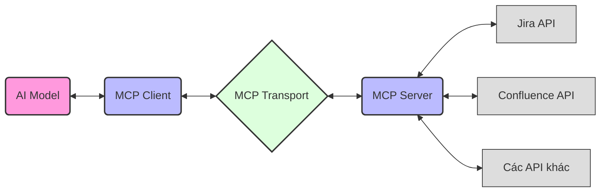
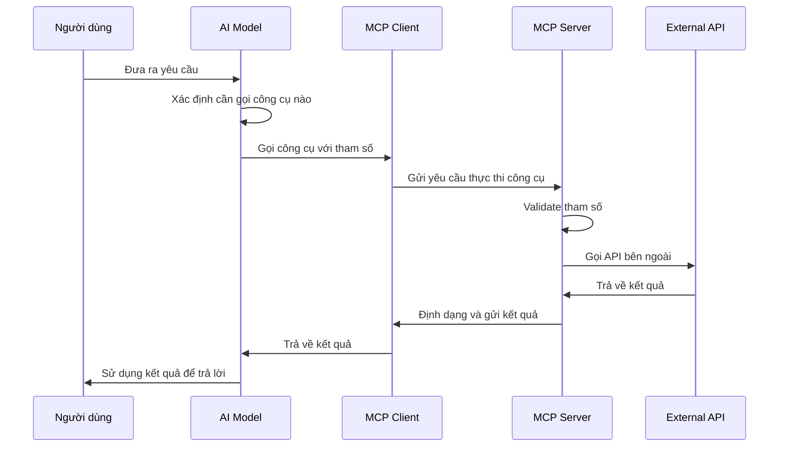
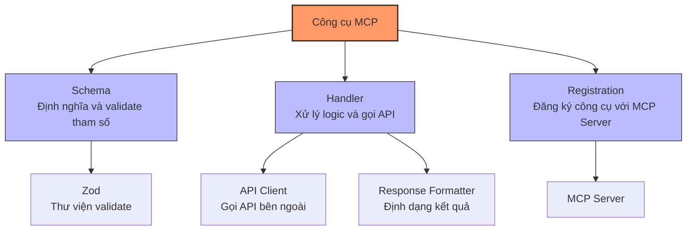
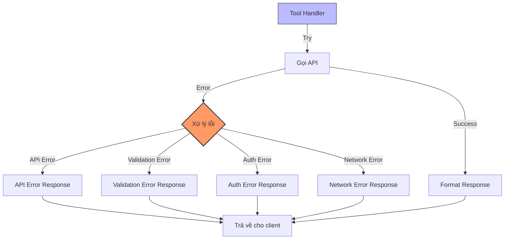
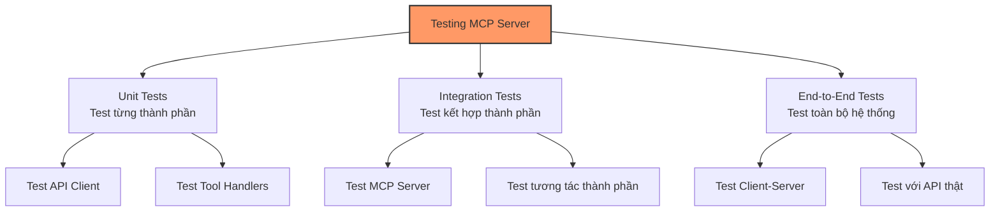
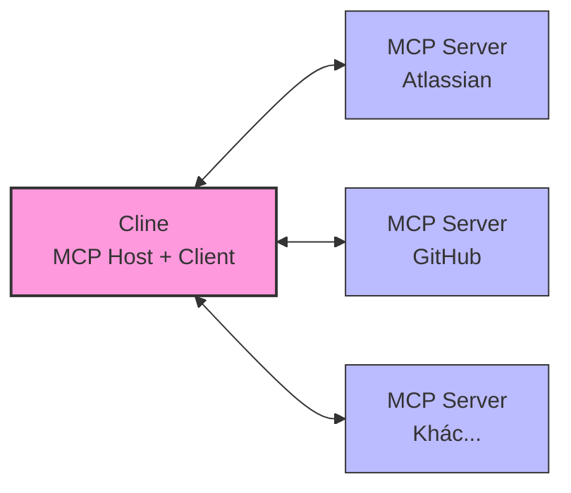
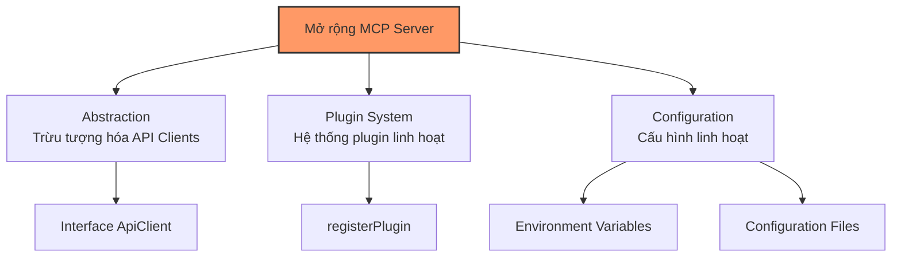
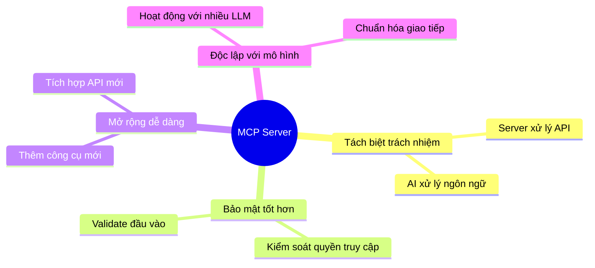

# Hướng Dẫn Toàn Diện Xây Dựng MCP Server

Hướng dẫn này giúp bạn hiểu và xây dựng một Model Context Protocol (MCP) Server, tạo cầu nối giữa trợ lý AI và các dịch vụ bên ngoài như Atlassian (Jira, Confluence) hoặc bất kỳ API nào khác.

## 1. Tổng Quan Về MCP (Model Context Protocol)

### 1.1. MCP Là Gì?

Model Context Protocol là một chuẩn mở cho phép các mô hình AI kết nối an toàn và theo ngữ cảnh với các công cụ và dịch vụ bên ngoài. MCP giải quyết một vấn đề cốt lõi: **làm thế nào để AI sử dụng được các dịch vụ mà nó không được huấn luyện để tương tác**.

### 1.2. Thành Phần Chính Của MCP

MCP bao gồm 3 thành phần chính, mỗi thành phần đều có vai trò quan trọng:

1. **MCP Client**: 
   - Tích hợp với mô hình AI
   - Gửi yêu cầu từ AI đến server 
   - Nhận và xử lý kết quả trả về

2. **MCP Transport**: 
   - Lớp trung gian vận chuyển dữ liệu
   - Hỗ trợ nhiều giao thức: HTTP, WebSocket, STDIO
   - Định dạng giao tiếp giữa client và server

3. **MCP Server**: 
   - Đăng ký và quản lý các công cụ (tools)
   - Nhận yêu cầu từ client và thực thi công cụ tương ứng
   - Gọi API bên ngoài và trả kết quả về client



### 1.3. Lợi Ích Của MCP

- **Tách biệt trách nhiệm**: AI tập trung vào xử lý ngôn ngữ, MCP Server tập trung vào tương tác với API
- **Mở rộng dễ dàng**: Thêm công cụ mới mà không cần huấn luyện lại mô hình
- **Bảo mật tốt hơn**: Kiểm soát được các hành động mà AI có thể thực hiện
- **Độc lập với mô hình**: Hoạt động với bất kỳ mô hình AI nào hỗ trợ gọi công cụ

## 2. Kiến Trúc Tổng Thể Của MCP Server

### 2.1. Tổ Chức Thư Mục

```
my-mcp-server/
├── src/
│   ├── index.ts                  # Entry point - khởi tạo server
│   ├── tools/                    # Các công cụ (tools) cho MCP
│   │   └── [service]/           # Nhóm công cụ theo dịch vụ (jira, confluence...)
│   ├── utils/                    # Tiện ích chung
│   │   ├── api-client.ts        # Client gọi API bên ngoài
│   │   ├── logger.ts            # Hệ thống ghi log
│   │   └── tool-wrapper.ts      # Wrapper xử lý context cho tools
│   └── config/                   # Cấu hình ứng dụng
├── .env                          # Biến môi trường
└── package.json                  # Cấu hình npm
```

### 2.2. Luồng Xử Lý Trong MCP

Khi AI cần tương tác với API bên ngoài:



## 3. Các Thành Phần Cốt Lõi Của MCP Server

### 3.1. Server Initialization

File `index.ts` là điểm khởi đầu, chịu trách nhiệm:
- Khởi tạo MCP Server
- Đăng ký các công cụ
- Thiết lập transport layer

```typescript
// Ví dụ đơn giản về khởi tạo MCP Server
import { McpServer } from '@modelcontextprotocol/sdk/server/mcp.js';
import { StdioServerTransport } from '@modelcontextprotocol/sdk/server/stdio.js';

// Khởi tạo server
const server = new McpServer({
  name: 'my-mcp-server',
  version: '1.0.0'
});

// Đăng ký các công cụ
registerTools(server);

// Thiết lập transport và khởi động server
const transport = new StdioServerTransport();
server.connect(transport)
  .then(() => console.log('MCP Server started'))
  .catch(error => console.error('Failed to start:', error));
```

### 3.2. Tool Definition (Định Nghĩa Công Cụ)

Mỗi công cụ trong MCP bao gồm 3 thành phần chính:



Ví dụ về định nghĩa công cụ:

```typescript
// Ví dụ về định nghĩa công cụ đơn giản
import { z } from 'zod';
import { McpServer } from '@modelcontextprotocol/sdk/server/mcp.js';

// 1. Schema - định nghĩa tham số đầu vào
const exampleSchema = z.object({
  param1: z.string().describe('Mô tả cho tham số 1'),
  param2: z.number().optional().describe('Tham số tùy chọn')
});

// 2. Handler - xử lý logic
async function exampleHandler(params, context) {
  try {
    // Gọi API bên ngoài
    const result = await callExternalApi(params);
    
    // Trả về kết quả thành công
    return createSuccessResponse(result);
  } catch (error) {
    // Trả về lỗi
    return createErrorResponse(error);
  }
}

// 3. Registration - đăng ký công cụ
export function registerExampleTool(server: McpServer) {
  server.tool(
    'exampleTool',            // Tên công cụ
    'Mô tả về công cụ này',   // Mô tả
    exampleSchema,            // Schema
    exampleHandler            // Handler
  );
}
```

### 3.3. API Client (Client Gọi API)

API Client là lớp trung gian giữa MCP Server và API bên ngoài, chịu trách nhiệm:
- Cấu hình kết nối với API (authentication, headers, base URL)
- Thực hiện các HTTP requests
- Xử lý lỗi và định dạng phản hồi

```typescript
// Ví dụ về API Client đơn giản
export async function callExternalApi(endpoint, method = 'GET', body) {
  const url = `${BASE_URL}${endpoint}`;
  
  const headers = {
    'Authorization': `Bearer ${API_TOKEN}`,
    'Content-Type': 'application/json'
  };
  
  try {
    const response = await fetch(url, {
      method,
      headers,
      body: body ? JSON.stringify(body) : undefined
    });
    
    if (!response.ok) {
      throw new Error(`API error: ${response.status}`);
    }
    
    return await response.json();
  } catch (error) {
    console.error(`API call failed: ${error.message}`);
    throw error;
  }
}
```

### 3.4. Context Management (Quản Lý Context)

Context trong MCP cho phép:
- Chia sẻ dữ liệu giữa các lần gọi công cụ
- Lưu trữ cấu hình và trạng thái
- Truyền thông tin xác thực và phiên làm việc

```typescript
// Ví dụ về wrapper xử lý context
export function wrapToolHandler(registerFn, server, config) {
  // Tạo proxy để bắt các đăng ký công cụ
  const proxyServer = {
    tool: (name, description, schema, handler) => {
      // Đăng ký công cụ với handler được wrap
      server.tool(name, description, schema, async (params, context) => {
        try {
          // Tạo context đơn giản với config
          const simpleContext = {
            config,
            get: (key) => key === 'config' ? config : undefined
          };
          
          // Gọi handler gốc với context đã được chuẩn bị
          return await handler(params, simpleContext);
        } catch (error) {
          return createErrorResponse(error);
        }
      });
    }
  };
  
  // Gọi hàm đăng ký với server proxy
  registerFn(proxyServer);
}
```

## 4. Các Loại Công Cụ (Tools) Cho Atlassian

### 4.1. Công Cụ Jira

Công cụ cho Jira tập trung vào quản lý issues:

| Tên Công Cụ | Mục Đích | Tham Số Chính |
|-------------|----------|---------------|
| `getIssue` | Lấy thông tin chi tiết về một issue | `issueIdOrKey` |
| `searchIssues` | Tìm kiếm issues theo JQL | `jql`, `maxResults` |
| `createIssue` | Tạo issue mới | `projectKey`, `summary`, `description`, `issueType` |
| `updateIssue` | Cập nhật thông tin issue | `issueIdOrKey`, `fields` |
| `transitionIssue` | Chuyển trạng thái của issue | `issueIdOrKey`, `transitionId` |
| `assignIssue` | Gán issue cho người dùng | `issueIdOrKey`, `accountId` |

### 4.2. Công Cụ Confluence

Công cụ cho Confluence tập trung vào quản lý nội dung:

| Tên Công Cụ | Mục Đích | Tham Số Chính |
|-------------|----------|---------------|
| `getPage` | Lấy thông tin chi tiết về trang | `pageId` |
| `searchPages` | Tìm kiếm trang theo CQL | `cql`, `limit` |
| `createPage` | Tạo trang mới | `spaceKey`, `title`, `content` |
| `updatePage` | Cập nhật nội dung trang | `pageId`, `title`, `content`, `version` |
| `getSpaces` | Lấy danh sách spaces | `limit`, `type` |
| `addComment` | Thêm comment vào trang | `pageId`, `content` |

## 5. Xử Lý Các Vấn Đề Phổ Biến

### 5.1. Authentication và Authorization

- **Basic Authentication**: Sử dụng cho Atlassian Cloud
  ```typescript
  const auth = Buffer.from(`${EMAIL}:${API_TOKEN}`).toString('base64');
  headers['Authorization'] = `Basic ${auth}`;
  ```

- **OAuth 2.0**: Phổ biến cho các API hiện đại
  ```typescript
  headers['Authorization'] = `Bearer ${ACCESS_TOKEN}`;
  ```

- **API Tokens**: Đơn giản và an toàn
  ```typescript
  headers['X-API-Key'] = API_TOKEN;
  ```

### 5.2. Error Handling (Xử Lý Lỗi)



Các loại lỗi phổ biến và cách xử lý:

1. **API Errors**: Lỗi từ API bên ngoài
   - Phân loại theo HTTP status code
   - Trích xuất thông tin lỗi từ response body

2. **Validation Errors**: Lỗi tham số đầu vào
   - Sử dụng Zod để validate trước khi gọi API
   - Trả về lỗi cụ thể về tham số không hợp lệ

3. **Authentication Errors**: Lỗi xác thực
   - Kiểm tra token hết hạn
   - Hướng dẫn cách lấy token mới

4. **Network Errors**: Lỗi mạng
   - Implement retry logic
   - Timeout hợp lý

### 5.3. Rate Limiting và Performance

- **Rate Limiting**: Giới hạn số lượng requests
  - Implement token bucket algorithm
  - Theo dõi và giới hạn số lượng requests

- **Caching**: Lưu trữ tạm thời kết quả
  - Cache kết quả với TTL hợp lý
  - Invalidate cache khi có thay đổi

- **Batching**: Gộp nhiều requests thành một
  - Gộp nhiều queries nhỏ thành một query lớn
  - Giảm số lượng roundtrips

## 6. Testing và Debugging

### 6.1. Testing MCP Server

Các loại test cần thiết:



1. **Unit Tests**: Kiểm tra từng thành phần
   - Test API Client riêng
   - Test Tool Handlers riêng với mock API

2. **Integration Tests**: Kiểm tra kết hợp các thành phần
   - Test MCP Server với mock Transport
   - Test interaction giữa các thành phần

3. **End-to-End Tests**: Kiểm tra toàn bộ hệ thống
   - Test MCP Client gọi MCP Server và nhận kết quả
   - Test với API thật trong môi trường staging

### 6.2. Debugging Tips

- **Logging**: Ghi log chi tiết
  - Log mọi request và response
  - Log các bước xử lý trung gian

- **Request IDs**: Theo dõi requests
  - Mỗi request có một ID duy nhất
  - Truyền ID qua các thành phần để dễ theo dõi

- **Môi Trường Local**: Test nhanh
  - Sử dụng mock API để test nhanh
  - Sử dụng Docker để cô lập môi trường

## 7. Tích Hợp Với Trợ Lý AI

### 7.1. Tích Hợp Với Cline

Cline là một trợ lý lập trình AI mã nguồn mở tích hợp vào Visual Studio Code dưới dạng tiện ích mở rộng. Cline đóng vai trò là một MCP Host tích hợp MCP Client, cho phép nó kết nối liền mạch với các MCP Server.



#### Cấu Hình Cline Cho MCP Server

MCP Server hỗ trợ nhiều phương thức kết nối, nhưng phương thức STDIO (Standard Input/Output) được khuyến nghị vì độ tin cậy cao nhất. Đặc biệt khi triển khai trong Docker, STDIO transport đơn giản và ít xảy ra lỗi nhất.

Bạn cần cấu hình trong file `cline_mcp_settings.json`:

```json
{
  "mcpServers": {
    "nphuc/atlassian-integration": {
      "command": "docker",
      "args": ["exec", "-i", "mcp-atlassian", "node", "dist/index.js"],
      "env": {}
    }
  }
}
```

#### Quy Trình Tích Hợp

1. **Build TypeScript thành JavaScript**:
   - Chạy lệnh `npm run build`
   - Đảm bảo file JavaScript đã được tạo trong thư mục `dist/`

2. **Triển khai với Docker**:
   - Tạo file `docker-compose.yml` và `Dockerfile`
   - Tạo script `start-docker.sh` để quản lý container
   - Chạy `./start-docker.sh` và chọn "Chạy MCP Server"

3. **Cấu Hình Cline**:
   - Tạo hoặc cập nhật file `cline_mcp_settings.json`
   - Sử dụng cấu hình command với exec để kết nối đến container
   - Không cần thiết lập lại các biến môi trường trong cấu hình này

4. **Sử Dụng MCP Server trong Cline**:
   - Cline sẽ tự động khởi động kết nối tới Docker container
   - MCP Server sẽ đọc cấu hình từ file `.env` trong container
   - Các công cụ Jira và Confluence sẽ hiển thị trong Cline

#### Lợi Ích Sử Dụng Docker Với STDIO Transport

- **Độ Tin Cậy Cao**: STDIO transport ít có khả năng gặp vấn đề kết nối
- **Tách Biệt Môi Trường**: Container cung cấp môi trường độc lập và nhất quán
- **Quản Lý Cấu Hình Đơn Giản**: Thông tin xác thực được lưu trong file `.env`
- **Dễ Dàng Nâng Cấp**: Container có thể được cập nhật mà không ảnh hưởng đến hệ thống
- **Tăng Tính Di Động**: Dễ dàng triển khai trên nhiều máy tính khác nhau

#### Xử Lý Sự Cố Kết Nối

Nếu bạn gặp vấn đề khi kết nối MCP Server với Cline, hãy kiểm tra:

1. **Container phải đang chạy**:
   ```bash
   docker ps --filter "name=mcp-atlassian"
   ```

2. **Kiểm tra logs của container**:
   ```bash
   docker logs mcp-atlassian
   ```

3. **Đảm bảo thông tin xác thực chính xác**:
   - Kiểm tra file `.env` đã được mount đúng
   - Xác nhận Atlassian API token còn hiệu lực
   - Đảm bảo tài khoản Atlassian có quyền truy cập API

### 7.2. Tích Hợp Với Web Applications

- **REST API Wrapper**:
  - Tạo endpoints RESTful cho mỗi công cụ
  - Implement authentication/authorization
  - Chuyển đổi requests/responses giữa REST và MCP

- **WebSocket cho Real-time**:
  - Sử dụng WebSocket để giao tiếp real-time
  - Stream kết quả về từng phần
  - Thông báo về trạng thái và tiến độ

## 8. Mở Rộng Cho Các Dịch Vụ Khác

### 8.1. Nguyên Tắc Mở Rộng



1. **Abstraction**: Tạo lớp trừu tượng cho API clients
   ```typescript
   interface ApiClient {
     callApi(endpoint: string, method: string, body?: any): Promise<any>;
   }
   ```

2. **Plugin System**: Hệ thống plugin linh hoạt
   ```typescript
   // Đăng ký plugin
   server.registerPlugin('github', githubPlugin);
   ```

3. **Configuration**: Cấu hình linh hoạt
   ```typescript
   // Cấu hình từ file hoặc biến môi trường
   const config = loadConfig('github');
   ```

### 8.2. Ví Dụ: GitHub Integration

Các bước tích hợp với GitHub API:

1. **Tạo GitHub API Client**:
   - Implement authentication với GitHub token
   - Xử lý các GitHub API endpoints

2. **Định Nghĩa Công Cụ GitHub**:
   - `getRepository`: Lấy thông tin repository
   - `searchIssues`: Tìm kiếm issues trong repository
   - `createPullRequest`: Tạo pull request mới

3. **Đăng Ký Công Cụ GitHub với MCP Server**:
   ```typescript
   registerGitHubTools(server, githubConfig);
   ```

## 9. Best Practices Và Patterns

### 9.1. Code Structure

- **Modular Design**: Thiết kế theo module
  - Mỗi service là một module riêng
  - Mỗi công cụ là một file riêng

- **Dependency Injection**: Tiêm phụ thuộc
  - Truyền các dependencies vào constructor/function
  - Dễ dàng mock cho testing

- **Configuration Management**: Quản lý cấu hình
  - Sử dụng dotenv cho biến môi trường
  - Validate cấu hình khi khởi động

### 9.2. Security

- **Credential Management**: Quản lý thông tin xác thực
  - Không hardcode credentials
  - Sử dụng biến môi trường hoặc vault service

- **Input Validation**: Validate đầu vào
  - Validate mọi input từ AI
  - Prevent injection attacks

- **Rate Limiting**: Giới hạn tần suất
  - Implement rate limiting cho cả MCP Server
  - Tôn trọng rate limits của API bên ngoài

### 9.3. Logging và Monitoring

- **Structured Logging**: Log có cấu trúc
  - Sử dụng JSON format cho logs
  - Bao gồm metadata hữu ích (timestamps, request IDs)

- **Error Tracking**: Theo dõi lỗi
  - Phân loại lỗi theo mức độ nghiêm trọng
  - Thông báo cho lỗi nghiêm trọng

- **Performance Metrics**: Đo lường hiệu suất
  - Theo dõi thời gian phản hồi
  - Đếm số lượng requests/errors

## 10. Kết Luận



MCP Server là cầu nối quan trọng giữa AI và các dịch vụ bên ngoài, cho phép:
- AI thực hiện các hành động trong thế giới thực
- Truy cập dữ liệu từ các nguồn khác nhau
- Mở rộng khả năng mà không cần huấn luyện lại mô hình

Lợi ích của việc sử dụng MCP:
- **Tách biệt trách nhiệm** giữa AI và integration logic
- **Bảo mật tốt hơn** với quyền truy cập có kiểm soát
- **Mở rộng dễ dàng** với các dịch vụ mới
- **Đơn giản hóa** việc tương tác giữa AI và hệ thống bên ngoài

Với hướng dẫn này, bạn đã có nền tảng vững chắc để xây dựng MCP Server cho bất kỳ dịch vụ API nào, tạo nên một hệ sinh thái mạnh mẽ để mở rộng khả năng của các trợ lý AI.

---

## Kế Hoạch Cải Tiến Hướng Dẫn

Dựa trên đánh giá và phản hồi từ các chuyên gia, chúng tôi đã xác định một số điểm cần cải tiến để làm cho hướng dẫn này toàn diện và chính xác hơn. Dưới đây là kế hoạch cải tiến:

### 1. Cập Nhật Kiến Trúc MCP Đầy Đủ

- **Bổ sung thành phần Host Application**: Tài liệu hiện tại mô tả 3 thành phần (Client, Transport, Server), nhưng kiến trúc chuẩn của MCP gồm 4 thành phần chính.
- **Làm rõ sự phân biệt giữa Host và Client**: Host là ứng dụng mà người dùng tương tác trực tiếp, trong khi Client là thành phần kỹ thuật được nhúng trong Host.
- **Chi tiết**: Xem thêm tại [building-mcp-server-guide-improve-1.md](dev_mcp-server-atlassian/building-mcp-server-guide-improve-1.md)

### 2. Bổ Sung Các Capabilities Của MCP

- **Thêm Resources**: Mô tả về cơ chế cung cấp dữ liệu có cấu trúc từ MCP Server cho AI thông qua MCP Client.
- **Thêm Prompts**: Giải thích về template tin nhắn được định nghĩa bởi server để chuẩn hóa tương tác với LLM.
- **Thêm Sampling**: Mô tả tính năng cho phép server yêu cầu hoàn thành từ mô hình LLM.
- **Chi tiết**: Xem thêm tại [building-mcp-server-guide-improve-2.md](dev_mcp-server-atlassian/building-mcp-server-guide-improve-2.md)

### 3. Cải Thiện Ví Dụ và Minh Họa

- Bổ sung ví dụ cụ thể với Jira và Confluence, minh họa luồng xử lý hoàn chỉnh
- Cung cấp ví dụ về việc định nghĩa và sử dụng Resources, Prompts, và Sampling
- Làm rõ sự khác biệt giữa các loại capabilities

### 4. Điều Chỉnh Nội Dung Hiện Có

- Cập nhật phần "Thành Phần Chính Của MCP" để phản ánh đúng kiến trúc 4 thành phần
- Bổ sung diagram minh họa cho các capabilities mới (Resources, Prompts, Sampling)
- Cập nhật luồng xử lý để bao gồm các khả năng mới

Chúng tôi dự định triển khai những cải tiến này trong bản cập nhật tiếp theo của hướng dẫn, nhằm cung cấp một tài liệu toàn diện và cập nhật về cách xây dựng MCP Server.

### Tài Liệu Tham Khảo

- [Đánh giá từ chuyên gia](dev_mcp-server-atlassian/building-mcp-server-guide-evaluation.md)
- [Cải tiến phần 1: Kiến trúc và Capabilities](dev_mcp-server-atlassian/building-mcp-server-guide-improve-1.md)
- [Cải tiến phần 2: Resources và Prompts](dev_mcp-server-atlassian/building-mcp-server-guide-improve-2.md)