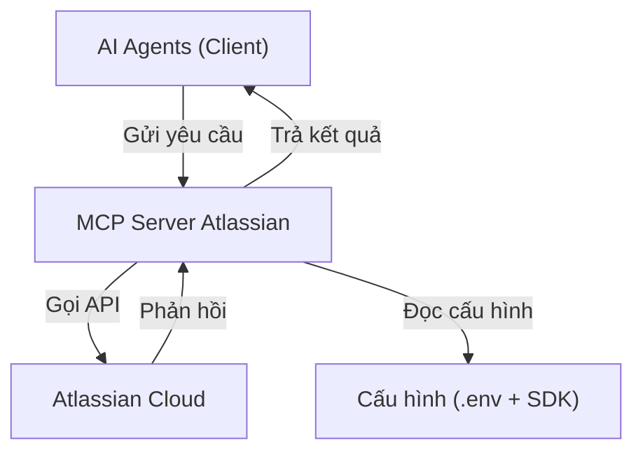
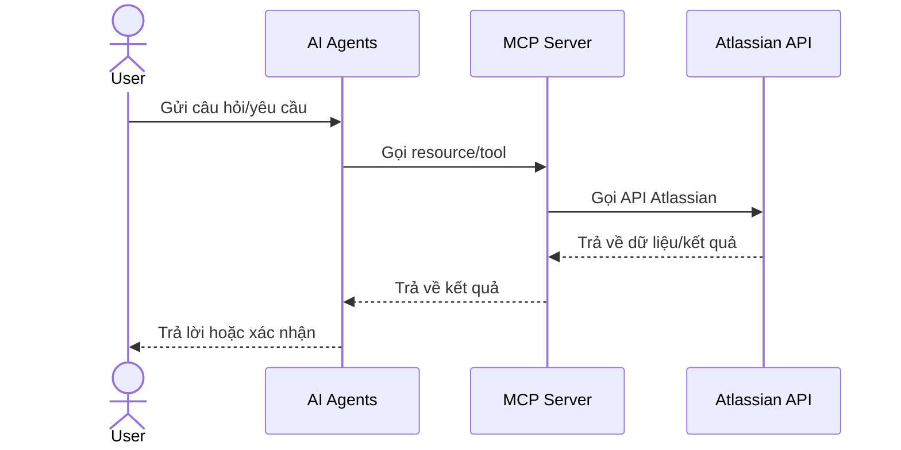
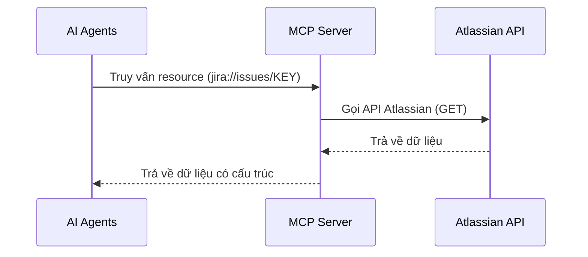
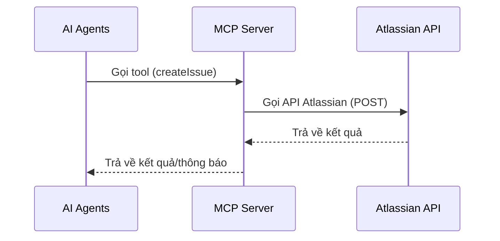

# Kiến Trúc và Tổng Quan về MCP Server

Tài liệu này cung cấp giới thiệu toàn diện về kiến trúc Model Context Protocol (MCP) Server, tập trung vào các khái niệm cốt lõi, nguyên tắc thiết kế và cách tiếp cận triển khai. Nó phục vụ như kiến thức nền tảng cho các nhà phát triển mới làm quen với việc phát triển MCP Server.

## 1. Tổng quan về Model Context Protocol (MCP)

### 1.1. MCP là gì?

Model Context Protocol (MCP) là một giao thức mở cho phép các mô hình AI tương tác với các nguồn dữ liệu và hệ thống bên ngoài theo cách tiêu chuẩn hóa. Nó giải quyết một thách thức quan trọng trong các ứng dụng AI: làm thế nào để cung cấp cho mô hình AI quyền truy cập an toàn và hiệu quả vào dữ liệu và chức năng từ thế giới thực.

Các khía cạnh chính của MCP bao gồm:

- **Giao tiếp tiêu chuẩn hóa**: Định nghĩa cách mô hình AI yêu cầu và nhận dữ liệu từ hệ thống bên ngoài
- **Kiến trúc dựa trên Resource**: Tổ chức thông tin thành các tài nguyên có thể địa chỉ hóa với các mẫu nhất quán
- **Bảo mật và kiểm soát truy cập**: Cung cấp cơ chế để kiểm soát dữ liệu và hành động nào có sẵn cho mô hình
- **Tương thích đa nền tảng**: Hoạt động trên các mô hình AI và hệ thống backend khác nhau

### 1.2. Hệ sinh thái MCP

Hệ sinh thái MCP bao gồm một số thành phần làm việc cùng nhau:

```
[AI Agents] <---> [MCP Client] <---> [MCP Server] <---> [Hệ thống Backend]
```

- **AI Agents**: Large Language Model (LLM) hoặc hệ thống AI khác tiêu thụ dữ liệu
- **MCP Client**: Thư viện bắt buộc để AI Agents có thể kết nối và giao tiếp với MCP Server sử dụng giao thức MCP
- **MCP Server**: Cầu nối kết nối yêu cầu AI với các triển khai backend cụ thể
- **Hệ thống Backend**: Nguồn dữ liệu, API và dịch vụ (như Atlassian, trong trường hợp của chúng ta)

### 1.3. Tại sao cần MCP cho tích hợp Atlassian?

Đối với tích hợp Atlassian cụ thể, MCP cung cấp một số lợi thế:

- **Giao diện nhất quán**: Cách tiêu chuẩn hóa cho AI truy cập dữ liệu Jira và Confluence
- **Tách biệt mối quan tâm**: Tách rời mô hình AI khỏi các chi tiết cụ thể của API Atlassian
- **Bảo mật**: Kiểm soát dữ liệu mà AI có thể truy cập trong hệ thống Atlassian
- **Khả năng mở rộng**: Dễ dàng thêm các resource và tool mới khi tính năng Atlassian phát triển
- **Tương tác hai chiều**: Cho phép AI không chỉ truy vấn mà còn thực hiện hành động (tạo issue, cập nhật trang...)
- **Chuẩn hóa giao tiếp**: Định nghĩa rõ ràng cách AI tương tác với hệ thống Atlassian

## 2. Kiến trúc MCP Server Atlassian

### 2.1. Mô hình kiến trúc tổng thể



### 2.2. Thành phần chính

1. **Host Application**: Ứng dụng tích hợp MCP (như Cline, Claude, VS Code)
2. **MCP Server**: Triển khai giao thức MCP (dự án này)
3. **Backend Systems**: Jira Cloud, Confluence Cloud
4. **Transport Layer**: STDIO, HTTP/SSE, WebSockets

### 2.3. Cơ chế hoạt động



### 2.4. Kiến trúc phân lớp

MCP Atlassian Server tuân theo kiến trúc phân lớp:

```
┌─────────────────────────────────────┐
│            Giao diện MCP            │
│  (Resource Templates & Tool Defs)   │
├─────────────────────────────────────┤
│         Xử lý Resource/Tool         │
│   (Xử lý yêu cầu & định dạng dữ liệu) │
├─────────────────────────────────────┤
│       Tích hợp API Atlassian        │
│  (API clients & chuyển đổi dữ liệu)  │
├─────────────────────────────────────┤
│        Xác thực & Cấu hình          │
│     (Thông tin đăng nhập & môi trường) │
└─────────────────────────────────────┘
```

Mỗi lớp trong kiến trúc có vai trò và trách nhiệm cụ thể:

1. **Lớp Giao diện MCP (Presentation)**
   - Định nghĩa các Resource templates và Tool definitions 
   - Cung cấp điểm giao tiếp cho AI Agents qua STDIO, HTTP hoặc WebSockets
   - Xử lý định dạng yêu cầu và phản hồi theo đặc tả MCP
   - Quản lý phiên và trạng thái kết nối

2. **Lớp Xử lý Resource/Tool (Business Logic)**
   - Xử lý logic kinh doanh từ yêu cầu AI tới hành động backend
   - Thực hiện xác thực và kiểm soát quyền
   - Chuyển đổi từ mô hình MCP sang các thực thể Atlassian
   - Triển khai các kiểm tra validation theo biz rules

3. **Lớp Tích hợp API Atlassian (Data Access)**
   - Gọi Atlassian REST API (Jira, Confluence)
   - Quản lý các tối ưu hóa (caching, rate limiting)
   - Xử lý lỗi API và retry strategies
   - Ánh xạ dữ liệu từ API sang đối tượng domain

4. **Lớp Xác thực & Cấu hình (Infrastructure)**
   - Quản lý cấu hình và biến môi trường
   - Xử lý xác thực OAuth với Atlassian
   - Logging, monitoring và telemetry
   - Quản lý vòng đời ứng dụng

Kiến trúc phân lớp này tạo điều kiện cho việc phát triển, bảo trì và mở rộng MCP Server. Mỗi lớp có thể được phát triển, kiểm thử và tối ưu hóa độc lập, đồng thời đảm bảo tách biệt rõ ràng các mối quan tâm.

## 3. Khái niệm cốt lõi trong MCP

### 3.1. Resources (Dữ liệu có cấu trúc)

Resources là phương tiện chính để truy xuất dữ liệu trong MCP. Chúng đại diện cho các thực thể có thể địa chỉ hóa mà mô hình AI có thể truy vấn thông tin.

Đặc điểm của MCP resources:

- **Địa chỉ URI**: Mỗi resource có URI duy nhất (ví dụ: `jira://issues`)
- **Chỉ đọc**: Resources được sử dụng để truy vấn/truy xuất dữ liệu, không sửa đổi
- **Có lược đồ**: Resources trả về dữ liệu trong cấu trúc được định nghĩa rõ ràng
- **Có thể lọc**: Thường bao gồm tham số truy vấn để lọc kết quả
- **Có thể kết hợp**: Resources có thể tham chiếu đến các resources khác

**Minh hoạ luồng truy vấn Resource:**



#### Đặc điểm chi tiết của Resources

- **Tập trung vào thực thể**: Resources được tổ chức xoay quanh các thực thể cụ thể (dự án, vấn đề, người dùng, trang) thay vì hành động
- **Không có tác dụng phụ**: Resources được đảm bảo không sửa đổi trạng thái server
- **Mẫu URI nhất quán**: Tuân theo các mẫu tiêu chuẩn hóa như `jira://issues/{issueKey}` để địa chỉ hóa trực quan
- **Do ứng dụng kiểm soát**: MCP Server kiểm soát dữ liệu nào được hiển thị và cách cấu trúc

Ví dụ về loại resource trong MCP Server Atlassian:
- Jira issues, projects, boards, filters
- Confluence spaces, pages, comments

### 3.2. Tools (Thực hiện hành động)

Tools đại diện cho các hoạt động có thể thực hiện để sửa đổi dữ liệu hoặc thực hiện tác vụ. Khác với resources, tools được sử dụng cho các thao tác thay đổi trạng thái.

Đặc điểm của MCP tools:

- **Giống hàm**: Được gọi với tham số để thực hiện một hành động cụ thể
- **Thao tác ghi/sửa đổi**: Tạo, cập nhật hoặc xóa dữ liệu
- **Lược đồ đầu vào**: Có tham số xác định rõ ràng và kiểm tra đầu vào
- **Quy ước đầu ra**: Trả về kết quả có cấu trúc về hành động đã thực hiện

**Minh hoạ luồng gọi Tool:**



#### Đặc điểm chi tiết của Tools

- **Tập trung vào hành động**: Tools được tổ chức xoay quanh hành động (tạo, cập nhật, chuyển đổi, gán) thay vì thực thể
- **Tạo ra tác dụng phụ**: Tools có chủ ý thay đổi trạng thái hệ thống khi được gọi
- **Thiết kế dựa trên lược đồ**: Tools có lược đồ đầu vào/đầu ra rõ ràng để xác thực và tài liệu
- **Gọi do mô hình kiểm soát**: Mô hình AI quyết định khi nào và cách sử dụng tools dựa trên yêu cầu người dùng
- **Xác nhận người dùng**: Thực thi tool thường yêu cầu xác nhận rõ ràng từ người dùng để đảm bảo an toàn và kiểm soát

Ví dụ về loại tool trong MCP Server Atlassian:
- Tạo hoặc cập nhật Jira issue
- Chuyển đổi trạng thái Jira issue
- Tạo hoặc cập nhật trang Confluence

### 3.3. Prompts (Template)

Prompts capability cho phép định nghĩa các template để chuẩn hóa cách AI nhận và xử lý yêu cầu. Trong MCP Atlassian Server, các prompt có thể được sử dụng để hướng dẫn AI cách khai thác thông tin từ Jira/Confluence.

**Ví dụ triển khai Prompt:**

```typescript
// Đăng ký prompt template
server.prompt(
  'summarize_issue',
  'Tạo bản tóm tắt về một issue Jira',
  z.object({
    issueKey: z.string().describe('Mã issue cần tóm tắt'),
    maxLength: z.number().optional().describe('Độ dài tối đa của bản tóm tắt')
  }),
  async (params, context) => {
    const { issueKey, maxLength = 200 } = params;
    
    // Hướng dẫn AI cách tóm tắt issue
    return `
    Tóm tắt issue ${issueKey} trong không quá ${maxLength} từ. 
    Hãy đảm bảo bao gồm các thông tin:
    1. Tiêu đề issue
    2. Trạng thái hiện tại
    3. Độ ưu tiên
    4. Người được gán
    5. Điểm chính của mô tả
    
    Trình bày ngắn gọn, súc tích và thông tin chính xác.
    `;
  }
);
```

### 3.4. Sampling (Tùy chỉnh generative)

Sampling capability cho phép tùy chỉnh các tham số sinh nội dung của mô hình AI, như temperature, top_p, maximum_tokens. Trong MCP Atlassian, sampling có thể được sử dụng để điều chỉnh độ sáng tạo khi AI tạo nội dung cho Jira/Confluence.

**Ví dụ triển khai Sampling:**

```typescript
// Đăng ký sampling params cho các loại nội dung khác nhau
server.sampling(
  'technical_description',
  'Tham số sampling cho mô tả kỹ thuật',
  {
    temperature: 0.2,  // Ưu tiên chính xác hơn sáng tạo
    top_p: 0.9,
    maximum_tokens: 500
  }
);

server.sampling(
  'creative_content',
  'Tham số sampling cho nội dung sáng tạo',
  {
    temperature: 0.7,  // Ưu tiên sáng tạo hơn
    top_p: 0.95,
    maximum_tokens: 1000
  }
);
```

### 3.5. Mẫu URI

MCP sử dụng các mẫu URI (Uniform Resource Identifier) để xác định duy nhất các tài nguyên. Chúng tuân theo định dạng nhất quán:

```
scheme://path/to/resource?query=parameter
```

Ví dụ:
- `jira://issues` - Liệt kê tất cả Jira issues
- `jira://issues/PROJ-123` - Lấy một Jira issue cụ thể
- `confluence://spaces/TEAM/pages` - Liệt kê các trang trong không gian Confluence cụ thể

Mẫu URI có thể bao gồm:
- **Tham số đường dẫn**: Các phần biến đổi của đường dẫn (ví dụ: `{issueKey}`)
- **Tham số truy vấn**: Tùy chọn lọc bổ sung (ví dụ: `?jql=project=TEAM`)

### 3.6. Xác thực và Context

Các hoạt động MCP yêu cầu xác thực với hệ thống backend. MCP Server quản lý việc xác thực này, xử lý:

- Token API và thông tin đăng nhập
- Quản lý phiên
- Xác minh quyền
- Giới hạn tốc độ và hạn ngạch

Context được truyền qua các hoạt động MCP, chứa:
- Thông tin xác thực
- Nhận dạng người dùng
- Dữ liệu phiên
- Metadata yêu cầu

Từ phiên bản 2.1.1, MCP Atlassian Server sử dụng các tiện ích helper chuẩn hóa để quản lý context:

```typescript
// Sử dụng helper từ v2.1.1 để lấy cấu hình Atlassian
try {
  const atlassianConfig = Config.getAtlassianConfigFromEnv();
  server.registerContext('atlassianConfig', atlassianConfig);
} catch (error) {
  console.error('Lỗi khi tải cấu hình Atlassian:', error.message);
  process.exit(1);
}
```

## 4. Tài liệu tham khảo

Để biết thêm chi tiết về triển khai MCP Server, vui lòng xem tài liệu [02-mcp-tools-resources.md](02-mcp-tools-resources.md) để hiểu về cách triển khai resources và tools.

- [Đặc tả giao thức MCP chính thức](https://github.com/modelcontextprotocol/mcp)
- [Tài liệu Atlassian REST API](https://developer.atlassian.com/cloud/jira/platform/rest/v3/intro/)
- [Jira REST API](https://developer.atlassian.com/cloud/jira/platform/rest/v3/intro/)
- [Confluence REST API](https://developer.atlassian.com/cloud/confluence/rest/v2/intro/)
- [Thực hành tốt nhất Node.js](https://github.com/goldbergyoni/nodebestpractices)

---

> "MCP Server là cầu nối quan trọng giúp AI hiểu và tương tác với hệ thống Atlassian một cách an toàn, có cấu trúc và hiệu quả."

---

*Cập nhật lần cuối: Tháng 5, 2025 (v2.1.1)* 