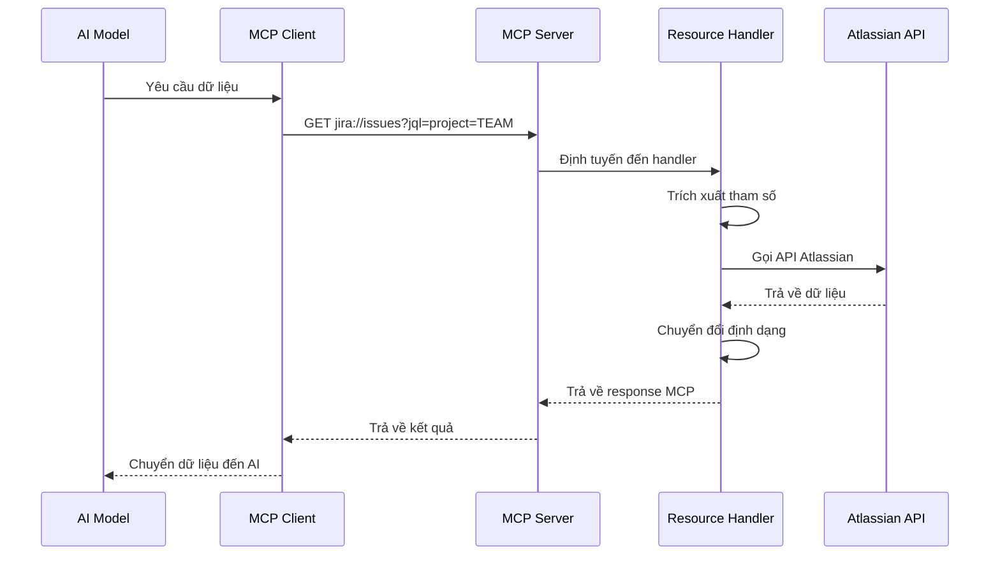
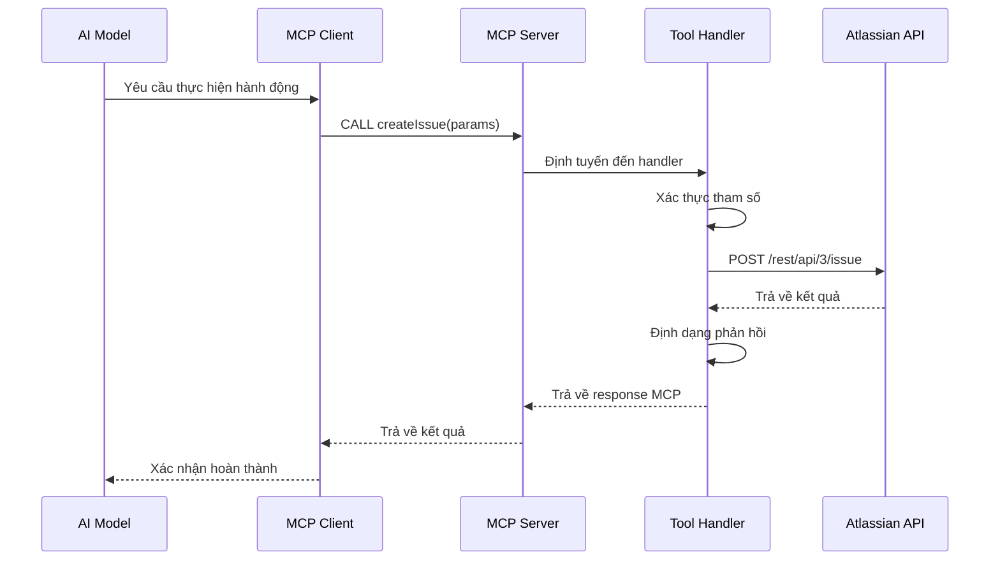
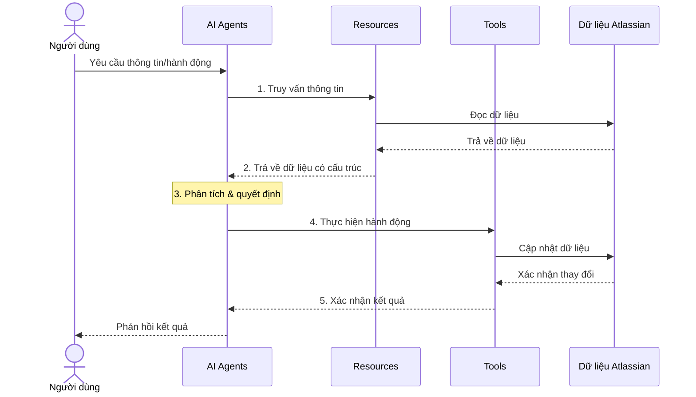
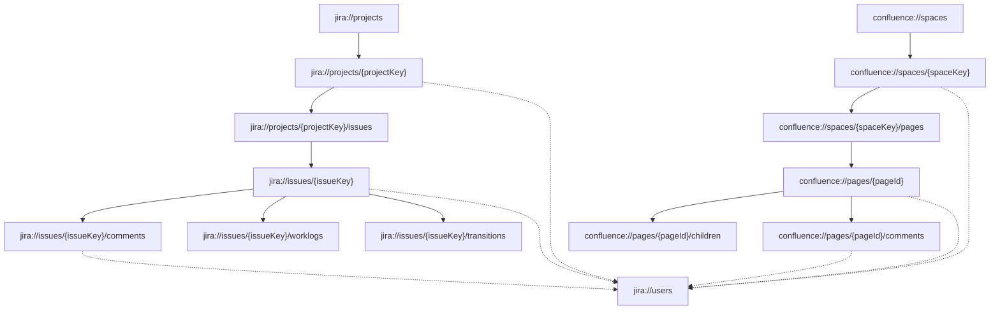
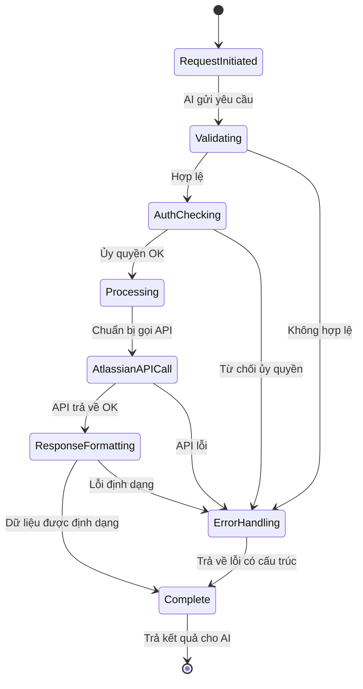
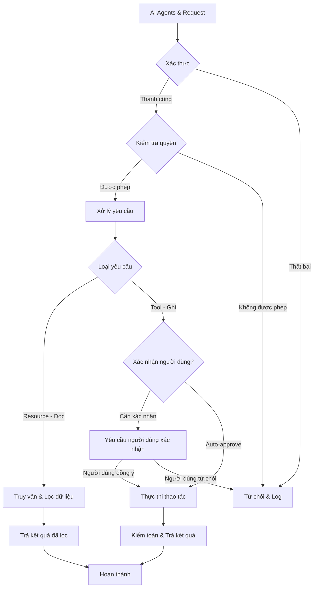

# Tools và Resources của MCP Server: Hướng dẫn phát triển

Tài liệu này cung cấp hướng dẫn chi tiết về việc phát triển resources và tools cho Model Context Protocol (MCP) Server, tập trung vào các cách tiếp cận triển khai thực tế với ví dụ từ mã nguồn MCP Server Atlassian.

## 1. Tổng quan về MCP Resources và Tools

Trong giao thức MCP, có hai cách chính để các mô hình AI tương tác với hệ thống bên ngoài:

- **Resources**: Endpoint chỉ đọc để truy xuất dữ liệu (thao tác GET)
- **Tools**: Endpoint định hướng hành động để sửa đổi dữ liệu hoặc thực hiện thao tác (thao tác POST/PUT/DELETE)

Hướng dẫn này sẽ hướng dẫn bạn qua chi tiết triển khai của cả hai, với trọng tâm là tổ chức mã, thực hành tốt nhất và ví dụ thực tế từ MCP Server Atlassian.

## 2. Chi tiết triển khai MCP Server

### 2.1. Phân rã thành phần

#### 2.1.1. Lớp giao diện MCP

Lớp này xuất các resources và tools cho MCP clients. Nó chịu trách nhiệm:
- Đăng ký URI và templates resource
- Đăng ký định nghĩa tool
- Xử lý khám phá resource (liệt kê các tài nguyên có sẵn)
- Xác thực các yêu cầu đến dựa trên schema

Các file chính:
- `src/index.ts` - Khởi tạo và đăng ký server
- `src/resources/index.ts` - Đăng ký resource
- `src/tools/index.ts` - Đăng ký tool

#### 2.1.2. Xử lý Resource/Tool

Lớp này triển khai logic nghiệp vụ cho mỗi resource và tool:
- Xử lý tham số
- Gọi API Atlassian thích hợp
- Chuyển đổi dữ liệu phản hồi sang định dạng MCP
- Xử lý lỗi và ghi nhật ký

Thư mục chính:
- `src/resources/jira/` - Triển khai resource Jira
- `src/resources/confluence/` - Triển khai resource Confluence
- `src/tools/jira/` - Triển khai tool Jira
- `src/tools/confluence/` - Triển khai tool Confluence

#### 2.1.3. Tích hợp API Atlassian

Lớp này xử lý giao tiếp trực tiếp với API Atlassian:
- REST API clients cho các endpoint Atlassian khác nhau
- Định dạng yêu cầu
- Phân tích phản hồi
- Xử lý lỗi và thử lại

Các file chính:
- `src/utils/atlassian-api-base.ts` - Chức năng API cơ bản
- `src/utils/jira-resource-api.ts` - API Jira cho resources
- `src/utils/confluence-resource-api.ts` - API Confluence cho resources
- `src/utils/jira-tool-api-v3.ts` - API Jira cho tools

#### 2.1.4. Xác thực & Cấu hình

Lớp này quản lý thông tin đăng nhập và cấu hình:
- Cấu hình dựa trên môi trường
- Quản lý thông tin đăng nhập
- Tạo header xác thực
- Cài đặt kết nối

Các file chính:
- `src/utils/mcp-helpers.ts` - Chứa namespace `Config` cho quản lý cấu hình
- `src/utils/atlassian-api-base.ts` - Chứa giao diện `AtlassianConfig`
- Biến môi trường (file `.env`) - Lưu trữ thông tin đăng nhập

### 2.2. Helpers chuẩn hóa (v2.1.1)

Từ phiên bản 2.1.1, MCP Atlassian Server sử dụng các helper chuẩn hóa để đảm bảo nhất quán:

#### mcp-core.js

Module này cung cấp các hàm core để tạo response chuẩn:

```typescript
/**
 * Tạo response thành công chuẩn
 */
export function createSuccessResponse(uri: string, message: string, data?: any): McpResponse {
  return createJsonResponse(uri, {
    success: true,
    message,
    ...(data && { data })
  });
}

/**
 * Tạo response lỗi chuẩn
 */
export function createErrorResponse(uri: string, message: string, details?: any): McpResponse {
  return {
    contents: [
      {
        uri,
        mimeType: 'application/json',
        text: JSON.stringify({
          success: false,
          message,
          ...(details && { details })
        })
      }
    ],
    isError: true
  };
}
```

#### mcp-helpers.js

Module này cung cấp các namespace helper chuẩn hóa:

```typescript
export namespace Config {
  /**
   * Lấy cấu hình Atlassian từ biến môi trường
   */
  export function getAtlassianConfigFromEnv(): AtlassianConfig {
    // Triển khai...
  }
}

export namespace Resources {
  /**
   * Tạo resource chuẩn hóa với metadata và schema
   */
  export function createStandardResource(
    uri: string,
    data: any[],
    dataKey: string,
    schema: any,
    totalCount: number,
    limit: number,
    offset: number,
    uiUrl?: string
  ): McpResponse {
    // Triển khai...
  }
}
```

### 2.3. Luồng dữ liệu

Khi MCP client yêu cầu dữ liệu, luồng qua hệ thống là:

1. MCP client gửi yêu cầu đến MCP server (ví dụ: `GET jira://issues?jql=project=TEAM`)
2. MCP server định tuyến yêu cầu đến handler resource thích hợp
3. Resource handler trích xuất tham số và xây dựng yêu cầu API Atlassian
4. Atlassian API client thực hiện yêu cầu HTTP đến Atlassian
5. Phản hồi được chuyển đổi sang định dạng MCP
6. Phản hồi được định dạng được trả về MCP client
7. MCP client chuyển dữ liệu đến mô hình AI

**Minh họa luồng xử lý Resource:**



**Minh họa luồng xử lý Tool:**



Đối với tools, luồng tương tự nhưng liên quan đến thay đổi trạng thái trong hệ thống backend. Các tool thường yêu cầu xác thực nghiêm ngặt hơn và có thể cần xác nhận từ người dùng trước khi thực hiện các thao tác thay đổi dữ liệu.

### 2.4. Mối quan hệ giữa Resources và Tools

Resources và Tools là hai khái niệm bổ sung cho nhau trong MCP, cùng nhau tạo nên một hệ thống hoàn chỉnh để AI Agents tương tác với Atlassian.



**Ví dụ luồng hoàn chỉnh:** Khi AI Agents giúp người dùng quản lý issues trong Jira:

1. AI sử dụng Resource `jira://issues` để liệt kê các issues hiện tại
2. AI phân tích dữ liệu issues trả về
3. Dựa trên yêu cầu người dùng, AI quyết định cần tạo issue mới 
4. AI sử dụng Tool `createIssue` để tạo issue trong Jira
5. Sau khi issue được tạo, AI sử dụng Resource `jira://issues/{issueKey}` để xác nhận thông tin đã tạo

Qua ví dụ này, ta thấy Resources (đọc) và Tools (ghi) làm việc cùng nhau để tạo một vòng phản hồi khép kín, cho phép AI tương tác hiệu quả với hệ thống Atlassian.

### 2.5. Taxonomy URI và Mối quan hệ Data

MCP sử dụng cấu trúc URI nhất quán để tổ chức và truy cập dữ liệu. Cấu trúc này tạo ra một taxonomy dữ liệu rõ ràng:

```
[scheme]://[collection]/[identifier]?[parameters]
    |           |             |          |
    |           |             |          └── Bộ lọc, sắp xếp, phân trang
    |           |             └───────────── Mã định danh cụ thể (IDs)
    |           └─────────────────────────── Loại tài nguyên (issues, projects)
    └─────────────────────────────────────── Dịch vụ (jira, confluence)
```

**Mối quan hệ dữ liệu trong Atlassian:**

Các resources trong MCP phản ánh cấu trúc dữ liệu và mối quan hệ giữa các đối tượng trong hệ sinh thái Atlassian:



Mô hình quan hệ này giúp AI Agents dễ dàng điều hướng và truy xuất dữ liệu liên quan, tương tự cách một người dùng điều hướng qua giao diện Atlassian.

### 2.6. Vòng đời yêu cầu MCP

Mỗi yêu cầu MCP trải qua một vòng đời được định nghĩa rõ ràng, từ khi khởi tạo đến khi hoàn thành:



**Xử lý lỗi trong MCP Server:**

MCP Server triển khai xử lý lỗi toàn diện để đảm bảo AI Agents luôn nhận được phản hồi có cấu trúc, ngay cả khi có lỗi:

- **Lỗi xác thực**: Khi token API không hợp lệ hoặc hết hạn
- **Lỗi ủy quyền**: Khi người dùng không có quyền truy cập tài nguyên
- **Lỗi API**: Khi Atlassian API trả về lỗi (503, 429, v.v.)
- **Lỗi định dạng**: Khi không thể chuyển đổi dữ liệu API thành định dạng MCP

Mỗi loại lỗi được trả về trong cấu trúc chuẩn hóa với mã lỗi, thông báo và hướng dẫn khắc phục, giúp AI Agents xử lý lỗi một cách thông minh.

### 2.7. Mô hình bảo mật

MCP Server triển khai mô hình bảo mật nhiều lớp để bảo vệ dữ liệu và đảm bảo tương tác an toàn:

1. **Xác thực API Atlassian**:
   - OAuth 2.0 với JWT
   - Quản lý token và refresh
   - Xác thực theo ngữ cảnh

2. **Kiểm soát quyền truy cập**:
   - Phân quyền dựa trên người dùng Atlassian
   - Kiểm tra quyền truy cập resource
   - Kiểm soát quyền thực thi tool

3. **Bảo vệ dữ liệu**:
   - Lọc dữ liệu nhạy cảm
   - Hạn chế phạm vi truy vấn
   - Chuẩn hóa output

4. **Xác nhận hành động**:
   - Yêu cầu xác nhận cho các thao tác ghi
   - Theo dõi và kiểm toán
   - Khả năng hoàn tác thao tác



Mô hình bảo mật này đảm bảo rằng AI Agents chỉ có thể truy cập và thao tác trên dữ liệu mà người dùng có quyền, và các thao tác quan trọng đều yêu cầu xác nhận rõ ràng từ người dùng.

## 3. Hiểu về MCP Resources

### 3.1. MCP Resources là gì?

Resources trong MCP là endpoint có thể địa chỉ hóa trả về dữ liệu về các thực thể cụ thể. Chúng:

- Có mẫu URI duy nhất (ví dụ: `jira://issues`, `confluence://pages/{pageId}`)
- Hỗ trợ tham số truy vấn để lọc và phân trang
- Trả về dữ liệu ở định dạng nhất quán, được xác thực schema
- Chỉ đọc (không sửa đổi dữ liệu)

### 3.2. Cấu trúc thư mục Resource

Trong MCP Server Atlassian, resources được tổ chức theo sản phẩm và loại thực thể:

```
/src
  /resources
    /jira
      issues.ts              # Jira issue resources
      projects.ts            # Jira project resources
      boards.ts              # Jira board resources
      ...
    /confluence
      spaces.ts              # Confluence space resources
      pages.ts               # Confluence page resources
      ...
    index.ts                 # Đăng ký resource chính
```

## 4. Triển khai MCP Resources

### 4.1. Tạo Resource mới

Để tạo resource mới, hãy làm theo các bước sau:

1. Tạo file mới trong thư mục thích hợp (ví dụ: `src/resources/jira/your-resource.ts`)
2. Định nghĩa template và handler resource
3. Đăng ký resource với tên duy nhất
4. Cập nhật đăng ký resource trong file index

### 4.2. Cấu trúc file Resource

Một file resource tiêu chuẩn bao gồm:

```typescript
// Import thư viện cần thiết
import { McpServer, ResourceTemplate } from '@modelcontextprotocol/sdk/server/mcp.js';
import { Logger } from '../../utils/logger.js';
import { AtlassianConfig } from '../../utils/atlassian-api-base.js';
// Import schemas và API helpers
import { yourSchema } from '../../schemas/your-schema.js';
import { yourApiFunction } from '../../utils/your-api-function.js';

// Khởi tạo logger
const logger = Logger.getLogger('YourResource');

// Hàm lấy cấu hình Atlassian từ môi trường
// (Quan trọng: mỗi file resource nên có hàm riêng)
function getAtlassianConfigFromEnv(): AtlassianConfig {
  const ATLASSIAN_SITE_NAME = process.env.ATLASSIAN_SITE_NAME || '';
  const ATLASSIAN_USER_EMAIL = process.env.ATLASSIAN_USER_EMAIL || '';
  const ATLASSIAN_API_TOKEN = process.env.ATLASSIAN_API_TOKEN || '';

  if (!ATLASSIAN_SITE_NAME || !ATLASSIAN_USER_EMAIL || !ATLASSIAN_API_TOKEN) {
    throw new Error('Thiếu thông tin đăng nhập Atlassian trong biến môi trường');
  }

  return {
    baseUrl: ATLASSIAN_SITE_NAME.includes('.atlassian.net') 
      ? `https://${ATLASSIAN_SITE_NAME}` 
      : ATLASSIAN_SITE_NAME,
    email: ATLASSIAN_USER_EMAIL,
    apiToken: ATLASSIAN_API_TOKEN
  };
}

// Hàm đăng ký resource với MCP Server
export function registerYourResource(server: McpServer) {
  logger.info('Đăng ký Your Resource...');

  server.resource(
    'your-resource-name',  // Tên duy nhất cho resource
    new ResourceTemplate('your://resource/pattern/{param}', {  // Mẫu URI với tham số
      list: async (_extra) => ({
        resources: [
          {
            uri: 'your://resource/pattern/{param}',
            name: 'Tên Resource Của Bạn',
            description: 'Mô tả về resource của bạn',
            mimeType: 'application/json'
          }
        ]
      })
    }),
    async (uri, params, _extra) => {
      try {
        // Lấy cấu hình từ môi trường
        const config = getAtlassianConfigFromEnv();
        
        // Xử lý tham số từ URI
        const param = Array.isArray(params.param) ? params.param[0] : params.param;
        
        // Gọi API Atlassian
        const data = await yourApiFunction(config, param);
        
        // Định dạng chuỗi URI
        const uriString = typeof uri === 'string' ? uri : uri.href;
        
        // Trả về kết quả ở định dạng MCP
        return {
          contents: [{
            uri: uriString,
            mimeType: 'application/json',
            text: JSON.stringify({
              yourData: data,
              metadata: { 
                self: uriString,
                // Thêm metadata khác nếu cần
              }
            })
          }]
        };
      } catch (error) {
        logger.error(`Lỗi xử lý yêu cầu resource:`, error);
        throw error;
      }
    }
  );

  logger.info('Đăng ký Resource thành công');
}
```

### 4.3. Ví dụ thực tế: Jira Issues Resource

Dưới đây là ví dụ thực tế từ file `src/resources/jira/issues.ts`:

```typescript
// Trích từ src/resources/jira/issues.ts
server.resource(
  'jira-issues-list',
  new ResourceTemplate('jira://issues', {
    list: async (_extra) => ({
      resources: [
        {
          uri: 'jira://issues',
          name: 'Jira Issues',
          description: 'Liệt kê và tìm kiếm tất cả Jira issues',
          mimeType: 'application/json'
        }
      ]
    })
  }),
  async (uri, params, _extra) => {
    try {
      // Lấy cấu hình từ môi trường
      const config = getAtlassianConfigFromEnv();
      
      // Xử lý tham số
      const { limit, offset } = extractPagingParams(params);
      const jql = params?.jql ? (Array.isArray(params.jql) ? params.jql[0] : params.jql) : '';
      
      // Gọi API Jira
      const response = await searchIssues(config, jql, offset, limit);
      
      // Định dạng và trả về kết quả
      const uriString = typeof uri === 'string' ? uri : uri.href;
      return createStandardResource(
        uriString,
        response.issues || [],
        'issues',
        issueListSchema,
        response.total || 0,
        limit,
        offset,
        `${config.baseUrl}/issues/`
      );
    } catch (error) {
      logger.error('Lỗi khi lấy danh sách issue:', error);
      throw error;
    }
  }
);
```

### 4.4. Đăng ký Resource

Sau khi tạo file resource, đăng ký nó trong file index thích hợp:

```typescript
// Trong src/resources/jira/index.ts
import { registerYourResource } from './your-resource.js';

export function registerJiraResources(server: McpServer) {
  // Đăng ký resources khác...
  registerYourResource(server);
}

// Trong src/resources/index.ts (nếu không sử dụng index theo sản phẩm)
import { registerYourResource } from './your-resource.js';

export function registerAllResources(server: McpServer) {
  // Đăng ký resources khác...
  registerYourResource(server);
}
```

### 4.5. Mẫu URI Resource

Thiết kế mẫu URI resource của bạn để:

- **Dễ đoán**: Tuân theo quy ước đặt tên nhất quán
- **Phân cấp**: Phản ánh quan hệ cha-con
- **RESTful**: Tuân theo nguyên tắc đặt tên resource RESTful
- **Có thể truy vấn**: Hỗ trợ tham số truy vấn để lọc

Ví dụ về mẫu URI được thiết kế tốt:

- `jira://issues` - Liệt kê tất cả issues
- `jira://issues/{issueKey}` - Lấy một issue cụ thể
- `jira://projects/{projectKey}/issues` - Liệt kê issues trong dự án
- `confluence://spaces/{spaceKey}/pages` - Liệt kê trang trong không gian

### 4.6. Định dạng phản hồi Resource

Resources nên trả về dữ liệu ở định dạng nhất quán:

```json
{
  "yourData": [
    {
      "id": "123",
      "name": "Mục ví dụ",
      "properties": {
        "key1": "value1",
        "key2": "value2"
      }
    }
  ],
  "metadata": {
    "self": "your://resource/pattern/param",
    "totalResults": 100,
    "startAt": 0,
    "maxResults": 50
  }
}
```

Phần `metadata` thường bao gồm:
- `self`: URI của resource
- Thông tin phân trang (`totalResults`, `startAt`, `maxResults`)
- Metadata khác như phiên bản API, timestamp, v.v.

## 5. Hiểu về MCP Tools

### 5.1. MCP Tools là gì?

Tools trong MCP là endpoint giống hàm thực hiện hành động. Chúng:

- Có tên duy nhất (ví dụ: `createIssue`, `updatePage`)
- Chấp nhận tham số cho hành động
- Xác thực đầu vào dựa trên schema
- Thực hiện thay đổi trạng thái (tạo, cập nhật, xóa)
- Trả về kết quả của thao tác

### 5.2. Cấu trúc thư mục Tool

Trong MCP Server Atlassian, tools được tổ chức theo sản phẩm và chức năng:

```
/src
  /tools
    /jira
      create-issue.ts        # Tool tạo Jira issues
      update-issue.ts        # Tool cập nhật Jira issues
      ...
    /confluence
      create-page.ts         # Tool tạo trang Confluence
      update-page.ts         # Tool cập nhật trang Confluence
      ...
    index.ts                 # Đăng ký tool chính
```

## 6. Triển khai MCP Tools

### 6.1. Tạo Tool mới

Để tạo tool mới, hãy làm theo các bước sau:

1. Tạo file mới trong thư mục thích hợp (ví dụ: `src/tools/jira/your-tool.ts`)
2. Định nghĩa schema và handler tool
3. Đăng ký tool với tên duy nhất
4. Cập nhật đăng ký tool trong file index

### 6.2. Cấu trúc file Tool

Một file tool tiêu chuẩn bao gồm:

```typescript
// Import thư viện cần thiết
import { Logger } from '../../utils/logger.js';
import { AtlassianConfig } from '../../utils/atlassian-api-base.js';
// Import API helpers
import { yourToolApiFunction } from '../../utils/your-tool-api.js';

// Khởi tạo logger
const logger = Logger.getLogger('YourTool');

// Schema đầu vào cho tool
const YOUR_TOOL_SCHEMA = {
  type: 'object',
  properties: {
    param1: { 
      type: 'string', 
      description: 'Mô tả cho tham số 1' 
    },
    param2: { 
      type: 'number', 
      description: 'Mô tả cho tham số 2' 
    }
    // Thêm tham số khác...
  },
  required: ['param1'] // Tham số bắt buộc
};

// Hàm đăng ký tool
export function registerYourTool(server: any) {
  logger.info('Đăng ký Your Tool...');

  server.tool(
    'your-tool-name',  // Tên tool
    'Mô tả về chức năng của tool', // Mô tả tool
    YOUR_TOOL_SCHEMA, // Schema đầu vào
    async (params: any, context: any) => {
      try {
        // Lấy cấu hình từ context
        const { atlassianConfig } = context;
        
        // Xử lý tham số
        const { param1, param2 } = params;
        
        // Gọi API Atlassian
        const result = await yourToolApiFunction(atlassianConfig, param1, param2);
        
        // Trả về kết quả ở định dạng MCP
        return {
          content: [
            { type: 'text', text: `Thao tác hoàn thành thành công: ${result.id}` }
          ]
        };
      } catch (error) {
        logger.error(`Lỗi thực thi tool:`, error);
        return {
          content: [{ type: 'text', text: `Lỗi: ${error.message}` }],
          isError: true
        };
      }
    }
  );

  logger.info('Đăng ký Tool thành công');
}
```

### 6.3. Ví dụ thực tế: Create Issue Tool

Dưới đây là ví dụ thực tế từ file `src/tools/jira/create-issue.ts`:

```typescript
// Trích từ src/tools/jira/create-issue.ts
server.tool(
  'createIssue',
  'Tạo mới một issue trong Jira',
  {
    type: 'object',
    properties: {
      projectKey: { type: 'string', description: 'Mã dự án (ví dụ: PROJ)' },
      summary: { type: 'string', description: 'Tiêu đề/tóm tắt issue' },
      description: { type: 'string', description: 'Mô tả issue' },
      issueType: { type: 'string', description: 'Loại issue (ví dụ: "Task", "Bug")' },
      // Tham số khác...
    },
    required: ['projectKey', 'summary', 'issueType']
  },
  async (params, context) => {
    try {
      const { atlassianConfig } = context;
      
      // Chuẩn bị dữ liệu
      const issueData = {
        fields: {
          project: { key: params.projectKey },
          summary: params.summary,
          description: params.description,
          issuetype: { name: params.issueType }
          // Trường khác...
        }
      };
      
      // Gọi API Jira
      const result = await createJiraIssue(atlassianConfig, issueData);
      
      // Trả về kết quả
      return {
        content: [
          {
            type: 'text',
            text: `Đã tạo issue thành công ${result.key}: ${params.summary}`
          }
        ]
      };
    } catch (error) {
      logger.error(`Lỗi khi tạo Jira issue:`, error);
      return {
        content: [{ type: 'text', text: `Lỗi khi tạo issue: ${error.message}` }],
        isError: true
      };
    }
  }
);
```

### 6.4. Đăng ký Tool

Sau khi tạo file tool, đăng ký nó trong file index tool:

```typescript
// Trong src/tools/index.ts
import { registerYourTool } from './jira/your-tool.js';
// hoặc
import { registerYourTool } from './confluence/your-tool.js';

export function registerAllTools(server: any) {
  // Đăng ký tools khác...
  registerYourTool(server);
}
```

### 6.5. Schema đầu vào Tool

Schema đầu vào tool rất quan trọng cho việc xác thực và tài liệu. Schema được thiết kế tốt:

- Mô tả rõ ràng từng tham số
- Đánh dấu tham số bắt buộc và tùy chọn
- Cung cấp giá trị mặc định khi thích hợp
- Bao gồm thông tin kiểu và ràng buộc
- Có mô tả hữu ích cho mô hình AI

Ví dụ về schema tool tốt:

```typescript
{
  type: 'object',
  properties: {
    projectKey: { 
      type: 'string', 
      description: 'Mã dự án (ví dụ: "PROJ")'
    },
    summary: { 
      type: 'string', 
      description: 'Tóm tắt ngắn về issue'
    },
    description: { 
      type: 'string', 
      description: 'Mô tả chi tiết về issue',
      nullable: true 
    },
    issueType: { 
      type: 'string', 
      description: 'Loại issue cần tạo',
      enum: ['Bug', 'Task', 'Story', 'Epic'],
      default: 'Task'
    },
    priority: { 
      type: 'string', 
      description: 'Độ ưu tiên issue',
      enum: ['Highest', 'High', 'Medium', 'Low', 'Lowest'],
      nullable: true 
    }
  },
  required: ['projectKey', 'summary', 'issueType'],
  additionalProperties: false
}
```

## 7. Trải nghiệm cho nhà phát triển

### 7.1. Danh sách kiểm tra triển khai

Khi triển khai một Resource hoặc Tool mới, hãy đảm bảo tuân theo danh sách kiểm tra sau:

#### Triển khai Resource mới

- [ ] **Xác định URI**: Đặt tên URI tuân theo quy ước (`service://collection/identifier`)
- [ ] **Định nghĩa lược đồ**: Xác định lược đồ đầu ra với Zod
- [ ] **Tham số truy vấn**: Xác định các tham số truy vấn được hỗ trợ
- [ ] **Xử lý lỗi**: Triển khai xử lý các trường hợp lỗi phổ biến
- [ ] **Pagination**: Triển khai phân trang nếu resource trả về nhiều kết quả
- [ ] **Tối ưu hoá**: Xem xét caching và chiến lược tải dữ liệu
- [ ] **Tài liệu**: Cung cấp mô tả và ví dụ trong code
- [ ] **Kiểm thử**: Viết unit tests và integration tests

#### Triển khai Tool mới

- [ ] **Đặt tên**: Chọn tên cụ thể và mô tả rõ ràng
- [ ] **Tham số**: Định nghĩa lược đồ tham số đầu vào với Zod
- [ ] **Kết quả**: Định nghĩa cấu trúc kết quả đầu ra rõ ràng
- [ ] **Xác thực đầu vào**: Triển khai xác thực đầu vào kỹ lưỡng
- [ ] **Xử lý lỗi**: Triển khai xử lý lỗi toàn diện với thông báo hữu ích
- [ ] **Kiểm soát quyền**: Đảm bảo kiểm tra quyền truy cập
- [ ] **Kiểm thử**: Viết các test cases bao gồm các trường hợp biên và lỗi
- [ ] **Tài liệu**: Cung cấp ví dụ usage trong code

### 7.2. Quy trình debug và troubleshooting

Khi cần debug MCP Server, hãy tuân theo quy trình sau:

1. **Kiểm tra logs**:
   ```bash
   # Xem logs với mức độ debug
   LOG_LEVEL=debug npm start
   ```

2. **Sử dụng trace ID**:
   - Mỗi yêu cầu MCP được gán một traceId duy nhất
   - Tìm kiếm logs theo traceId để theo dõi yêu cầu đầu-cuối

3. **Công cụ debug**:
   - Sử dụng Node Inspector để debug code thời gian thực
   ```bash
   node --inspect server.js
   ```
   - Mở Chrome DevTools (chrome://inspect) để kết nối

4. **Lỗi thường gặp**:

   | Mã lỗi | Mô tả | Giải pháp |
   |--------|-------|-----------|
   | `AUTH_ERROR` | Lỗi xác thực | Kiểm tra thông tin đăng nhập và token Atlassian |
   | `PERMISSION_DENIED` | Không đủ quyền | Kiểm tra vai trò người dùng trong Atlassian |
   | `RATE_LIMIT` | Vượt quá giới hạn API | Triển khai exponential backoff |
   | `VALIDATION_ERROR` | Lỗi xác thực đầu vào | Kiểm tra lại tham số đầu vào |
   | `API_ERROR` | Lỗi từ Atlassian API | Kiểm tra logs Atlassian API |

5. **Performance profiling**:
   ```bash
   # Sử dụng Node.js built-in profiler
   node --prof server.js
   ```

### 7.3. Thực hành tốt và mẫu thiết kế

Khi phát triển MCP Server, hãy tuân theo các thực hành tốt sau:

1. **Clean Code**:
   - Đặt tên biến và hàm có ý nghĩa
   - Tách nhỏ hàm (mỗi hàm dưới 30 dòng)
   - Sử dụng TypeScript để tăng type safety

2. **Xử lý lỗi**:
   - Sử dụng try/catch cho các hoạt động không đồng bộ
   - Chuẩn hóa lỗi với class riêng
   - Báo cáo lỗi chi tiết nhưng không lộ thông tin nhạy cảm

3. **Bất đồng bộ**:
   - Sử dụng async/await thay vì callbacks
   - Xử lý Promise.all cho các hoạt động song song
   - Triển khai timeout cho tất cả các yêu cầu HTTP

4. **Cấu trúc project**:
   ```
   src/
   ├── resources/        # Định nghĩa các resources
   ├── tools/            # Định nghĩa các tools
   ├── services/         # Các dịch vụ nghiệp vụ
   ├── clients/          # API clients
   ├── utils/            # Tiện ích
   ├── config/           # Cấu hình
   └── index.ts          # Entry point
   ```

## 8. Tài liệu tham khảo

- [Đặc tả giao thức MCP chính thức](https://github.com/modelcontextprotocol/mcp)
- [Tài liệu Atlassian REST API](https://developer.atlassian.com/cloud/jira/platform/rest/v3/intro/)
- [Jira REST API](https://developer.atlassian.com/cloud/jira/platform/rest/v3/intro/)
- [Confluence REST API](https://developer.atlassian.com/cloud/confluence/rest/v2/intro/)
- [Thực hành tốt nhất Node.js](https://github.com/goldbergyoni/nodebestpractices)

---

*Cập nhật lần cuối: Tháng 5, 2025 (v2.1.1)*