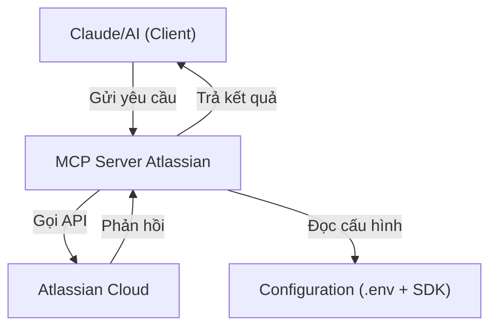
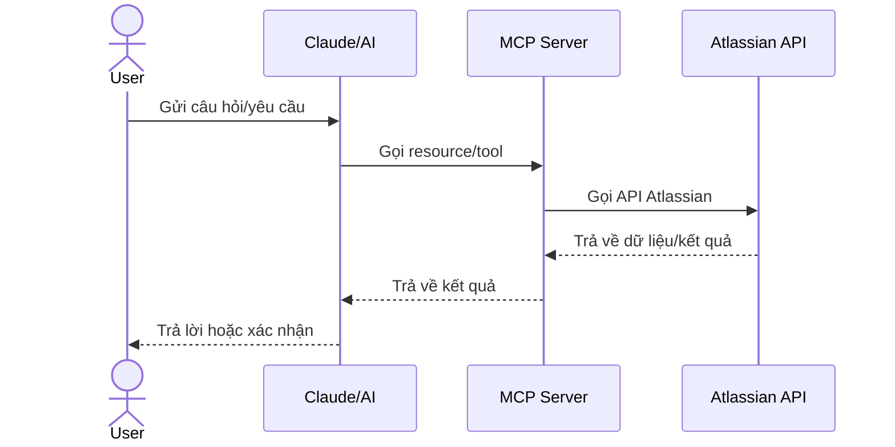
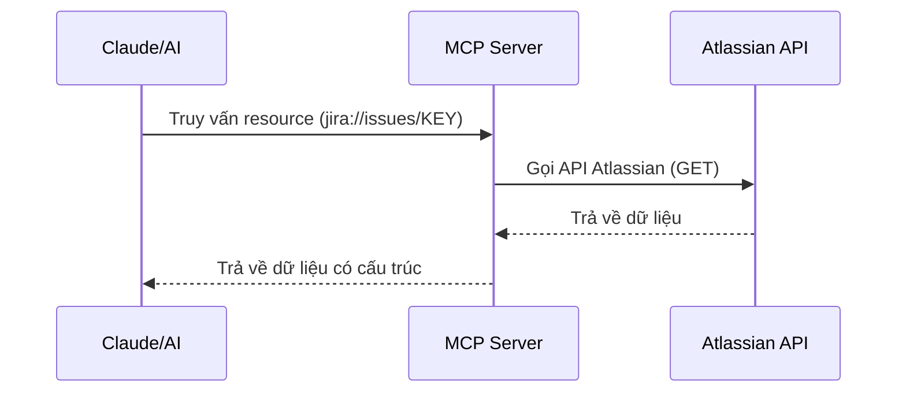
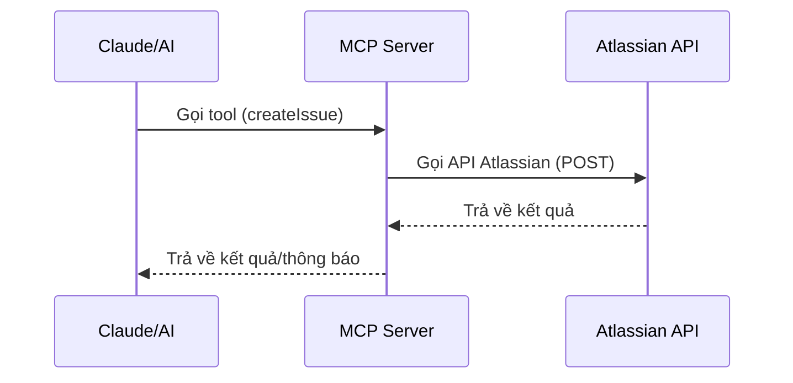

# Building MCP Server for Atlassian Integration

> **Note**: This document has been replaced by a more comprehensive series of guides:
> 
> 1. [MCP Overview, Concepts and Architecture](01-mcp-overview-architecture.md)
> 2. [MCP Tools and Resources Development Guide](02-mcp-tools-resources.md)
> 3. [MCP Prompting and Sampling Techniques](03-mcp-prompts-sampling.md)
>
> Please refer to these updated documents for the most current information.

---

*Content below is maintained for historical reference only*

# Xây dựng MCP Server: Từ Kiến Trúc đến Triển Khai

Tài liệu này hướng dẫn chi tiết việc xây dựng Model Context Protocol (MCP) Server cho Atlassian, từ khái niệm cơ bản đến triển khai thực tế. Bạn sẽ tìm hiểu về kiến trúc, các thành phần chính, và best practice khi xây dựng MCP server để tích hợp AI với hệ sinh thái Atlassian.

## 1. Tổng quan về MCP

### MCP là gì?

Model Context Protocol (MCP) là một giao thức tiêu chuẩn do Anthropic phát triển nhằm tạo ra cách thức giao tiếp thống nhất giữa các mô hình AI (như Claude) và các ứng dụng khác. MCP đóng vai trò như cầu nối, cho phép AI truy cập và thao tác với hệ thống bên ngoài một cách có cấu trúc và an toàn.

### Tại sao cần MCP Server cho Atlassian?

- **Tương tác hai chiều**: Cho phép AI truy vấn dữ liệu từ Jira/Confluence và thực hiện hành động (tạo issue, cập nhật trang...)
- **Đảm bảo an toàn**: Kiểm soát những gì AI có thể truy cập và thao tác
- **Chuẩn hóa giao tiếp**: Định nghĩa rõ ràng cách AI tương tác với hệ thống Atlassian
- **Mở rộng khả năng AI**: Cho phép AI tận dụng dữ liệu dự án và thực hiện tác vụ thông minh

## 2. Kiến trúc MCP Server Atlassian

### Mô hình kiến trúc tổng thể



### Thành phần chính

1. **Host Application**: Ứng dụng tích hợp MCP (như Cline, Claude, VS Code)
2. **MCP Server**: Triển khai giao thức MCP (dự án này)
3. **Backend Systems**: Jira Cloud, Confluence Cloud
4. **Transport Layer**: STDIO, HTTP/SSE, WebSockets

### Cơ chế hoạt động



## 3. Các Capability của MCP Server

MCP Server hỗ trợ 4 capability chính:

### 3.1 Resources (Dữ liệu)

Resources là cơ chế cung cấp dữ liệu cho AI, tương tự endpoint GET trong REST API. Resources được tổ chức theo entity và trả về dữ liệu có cấu trúc từ Atlassian.

**Xem chi tiết**: [Resource và Tool trong MCP Atlassian](./resource-and-tool-architecture.md#2-resource-dữ-liệu-có-cấu-trúc)

**Minh hoạ flow truy vấn Resource:**



### 3.2 Tools (Hành động)

Tools là cơ chế cho phép AI thực hiện hành động trên hệ thống Atlassian, tương tự endpoint POST/PUT/DELETE trong REST. Tools được tổ chức theo action và thường thay đổi trạng thái hệ thống.

**Xem chi tiết**: [Resource và Tool trong MCP Atlassian](./resource-and-tool-architecture.md#3-tool-thực-hiện-hành-động)

**Minh hoạ flow gọi Tool:**



**Ví dụ triển khai Tool (từ source code thực tế):**

```typescript
// Đăng ký tool để tạo issue mới
server.tool(
  'createIssue',
  'Tạo mới một issue trong Jira',
  createIssueSchema.shape,
  async (params, context) => {
    try {
      // Lấy cấu hình Atlassian
      const config = (context as any).atlassianConfig as AtlassianConfig;
      
      // Gọi handler xử lý logic
      const result = await createIssueHandler(params, config);

      // Trả về kết quả
      return createTextResponse(
        `Đã tạo issue thành công với key: ${result.key}`,
        { key: result.key, url: result.url }
      );
    } catch (error) {
      // Xử lý lỗi
      return createErrorResponse(`Lỗi khi tạo issue: ${error.message}`);
    }
  }
);
```

### 3.3 Prompts (Template)

Prompts capability cho phép định nghĩa các template để chuẩn hóa cách AI nhận và xử lý yêu cầu. Trong MCP Atlassian Server, các prompt có thể được sử dụng để hướng dẫn AI cách khai thác thông tin từ Jira/Confluence.

**Ví dụ triển khai Prompt:**

```typescript
// Đăng ký prompt template
server.prompt(
  'summarize_issue',
  'Tạo bản tóm tắt về một issue Jira',
  z.object({
    issueKey: z.string().describe('Mã issue cần tóm tắt'),
    maxLength: z.number().optional().describe('Độ dài tối đa của bản tóm tắt')
  }),
  async (params, context) => {
    const { issueKey, maxLength = 200 } = params;
    
    // Hướng dẫn AI cách tóm tắt issue
    return `
    Tóm tắt issue ${issueKey} trong không quá ${maxLength} từ. 
    Hãy đảm bảo bao gồm các thông tin:
    1. Tiêu đề issue
    2. Trạng thái hiện tại
    3. Độ ưu tiên
    4. Người được gán
    5. Điểm chính của mô tả
    
    Trình bày ngắn gọn, súc tích và thông tin chính xác.
    `;
  }
);
```

### 3.4 Sampling (Tùy chỉnh generative)

Sampling capability cho phép tùy chỉnh các tham số sinh nội dung của mô hình AI, như temperature, top_p, maximum_tokens. Trong MCP Atlassian, sampling có thể được sử dụng để điều chỉnh độ sáng tạo khi AI tạo nội dung cho Jira/Confluence.

**Ví dụ triển khai Sampling:**

```typescript
// Đăng ký sampling params cho các loại nội dung khác nhau
server.sampling(
  'technical_description',
  'Tham số sampling cho mô tả kỹ thuật',
  {
    temperature: 0.2,  // Ưu tiên chính xác hơn sáng tạo
    top_p: 0.9,
    maximum_tokens: 500
  }
);

server.sampling(
  'creative_content',
  'Tham số sampling cho nội dung sáng tạo',
  {
    temperature: 0.7,  // Ưu tiên sáng tạo hơn
    top_p: 0.95,
    maximum_tokens: 1000
  }
);
```

## 4. Xây dựng MCP Server từ A-Z

### 4.1 Chuẩn bị môi trường

```bash
# Tạo project mới
mkdir mcp-atlassian-server
cd mcp-atlassian-server
npm init -y

# Cài đặt dependencies
npm install @modelcontextprotocol/sdk zod dotenv cross-fetch

# Tạo cấu trúc thư mục
mkdir -p src/{resources,tools,utils,transports}
touch .env src/index.ts
```

### 4.2 Cấu hình .env

```
ATLASSIAN_SITE_NAME=your-site.atlassian.net
ATLASSIAN_USER_EMAIL=your-email@example.com
ATLASSIAN_API_TOKEN=your-api-token
```

### 4.3 Khởi tạo MCP Server

```typescript
// src/index.ts
import { McpServer } from '@modelcontextprotocol/sdk/server/mcp.js';
import { StdioServerTransport } from '@modelcontextprotocol/sdk/server/transports/stdio.js';

// Khởi tạo MCP Server với capabilities
const server = new McpServer(
  { name: 'mcp-atlassian', version: '1.0.0' },
  {
    capabilities: {
      resources: {},  // Cho phép truy vấn dữ liệu
      tools: {},      // Cho phép thực hiện hành động
      prompts: {},    // Cho phép sử dụng template
      sampling: {}    // Cho phép tùy chỉnh tham số sampling
    }
  }
);
    
// Đăng ký các resources, tools...
import { registerJiraResources } from './resources/jira/index.js';
import { registerConfluenceResources } from './resources/confluence/index.js';
import { registerAllTools } from './tools/index.js';

// Đăng ký context (để chia sẻ cấu hình Atlassian)
server.registerContext('atlassianConfig', {
  baseUrl: process.env.ATLASSIAN_SITE_NAME || '',
  email: process.env.ATLASSIAN_USER_EMAIL || '',
  apiToken: process.env.ATLASSIAN_API_TOKEN || ''
});

// Đăng ký transport (STDIO, HTTP/SSE, WebSockets)
const stdioTransport = new StdioServerTransport({
  onReady: () => console.log('MCP Server running on STDIO transport')
});

server.addTransport(stdioTransport);

// Khởi động server
registerJiraResources(server);
registerConfluenceResources(server);
registerAllTools(server);

console.log('MCP Atlassian Server is starting...');
```

### 4.4 Triển khai Resource và Tool

Chi tiết về triển khai Resource và Tool đã được mô tả trong tài liệu [Resource và Tool Architecture](./resource-and-tool-architecture.md). Dưới đây là quy trình chung:

1. **Xác định schema**: Định nghĩa cấu trúc dữ liệu input/output
2. **Triển khai handler**: Logic xử lý request và gọi API Atlassian
3. **Đăng ký với MCP Server**: Kết nối URI/tên với handler tương ứng
4. **Xử lý lỗi**: Đảm bảo phản hồi lỗi rõ ràng, thân thiện với người dùng

**Mô hình đăng ký tập trung:**

```typescript
// src/resources/jira/index.ts
import { registerIssueResources } from './issues.js';
import { registerProjectResources } from './projects.js';
import { registerUserResources } from './users.js';

export function registerJiraResources(server) {
  registerIssueResources(server);
  registerProjectResources(server);
  registerUserResources(server);
}

// src/tools/index.ts
import { registerCreateIssueTool } from './jira/create-issue.js';
import { registerUpdateIssueTool } from './jira/update-issue.js';
import { registerCreatePageTool } from './confluence/create-page.js';

export function registerAllTools(server) {
  registerCreateIssueTool(server);
  registerUpdateIssueTool(server);
  registerCreatePageTool(server);
  // ... đăng ký thêm các tool khác
}
```

## 5. Best Practice

### 5.1 Cho Resource

Tham khảo chi tiết: [Best Practice cho Resource](./resource-and-tool-architecture.md#4-best-practice)

1. **URI pattern nhất quán**: Tuân theo mô hình `{system}://{entity}/{id}/...`
2. **Metadata đầy đủ**: Mô tả schema, mimeType để client hiển thị đúng
3. **Error handling rõ ràng**: Phân loại lỗi, thông báo thân thiện
4. **Pagination hợp lý**: Hỗ trợ phân trang cho tài nguyên lớn

### 5.2 Cho Tool

Tham khảo chi tiết: [Best Practice cho Tool](./resource-and-tool-architecture.md#4-best-practice)

1. **Tên động từ/cụm động từ**: createIssue, updatePage, assignUser
2. **Schema validation**: Sử dụng Zod để định nghĩa và kiểm tra input
3. **Phản hồi đồng nhất**: Cấu trúc thông báo success/error nhất quán
4. **Tối thiểu hóa tham số**: Chỉ yêu cầu những thông tin thực sự cần thiết

### 5.3 Cho MCP Server nói chung

1. **Logging đầy đủ**: Ghi log cho request/response, lỗi, performance
2. **Caching hợp lý**: Cache các resource thường dùng (danh sách project, user)
3. **Rate limiting**: Kiểm soát số lượng request đến Atlassian API
4. **Context isolation**: Tách biệt context cho từng client
5. **Environment validation**: Kiểm tra biến môi trường trước khi khởi động

## 6. Testing và Debugging

### 6.1 Unit Testing cho Resource/Tool

```typescript
// test/resources/jira-issues.test.ts
import { expect } from 'chai';
import sinon from 'sinon';
import { getIssueHandler } from '../../src/resources/jira/issues.js';

describe('Jira Issue Resource', () => {
  let mockConfig, fetchStub;
  
  beforeEach(() => {
    mockConfig = { baseUrl: 'test.atlassian.net', email: 'test@example.com', apiToken: 'test-token' };
    fetchStub = sinon.stub(global, 'fetch');
  });
  
  afterEach(() => {
    fetchStub.restore();
  });
  
  it('should return formatted issue data', async () => {
    // Arrange
    const mockResponse = { ok: true, json: async () => ({ key: 'TEST-1', summary: 'Test Issue' }) };
    fetchStub.resolves(mockResponse);
    
    // Act
    const result = await getIssueHandler({ issueKey: 'TEST-1' }, mockConfig, new URL('jira://issues/TEST-1'));
    
    // Assert
    expect(result.issue).to.have.property('key', 'TEST-1');
    expect(result.issue).to.have.property('summary', 'Test Issue');
  });
  
  it('should handle API errors appropriately', async () => {
    // Arrange
    const mockResponse = { ok: false, status: 404, text: async () => 'Issue not found' };
    fetchStub.resolves(mockResponse);
    
    // Act & Assert
    try {
      await getIssueHandler({ issueKey: 'INVALID-1' }, mockConfig, new URL('jira://issues/INVALID-1'));
      expect.fail('Should have thrown an error');
    } catch (error) {
      expect(error.message).to.include('Issue not found');
    }
  });
});
```

### 6.2 Integration Testing

```typescript
// test/integration/jira-workflow.test.ts
import { expect } from 'chai';
import { McpServer } from '@modelcontextprotocol/sdk/server/mcp.js';
import { McpClient } from '@modelcontextprotocol/sdk/client/mcp.js';
import { MemoryTransport } from '../utils/memory-transport.js';

describe('Jira Workflow Integration', () => {
  let server, client, transport;
  
  before(() => {
    // Khởi tạo server với memory transport
    server = new McpServer({ name: 'test-server', version: '1.0.0' }, { capabilities: { resources: {}, tools: {} } });
    // Đăng ký resources, tools với server
    
    // Kết nối client-server
    transport = new MemoryTransport();
    server.addTransport(transport.serverSide);
    client = new McpClient();
    client.addTransport(transport.clientSide);
  });
  
  it('should complete an issue workflow', async () => {
    // Tạo issue mới
    const createResult = await client.tools.createIssue({ projectKey: 'TEST', summary: 'Test Issue' });
    expect(createResult).to.have.property('key');
    const issueKey = createResult.key;
    
    // Lấy thông tin issue
    const issueResource = await client.resources.get(`jira://issues/${issueKey}`);
    expect(issueResource.issue).to.have.property('key', issueKey);
    
    // Chuyển trạng thái issue
    const transitionResult = await client.tools.transitionIssue({ 
      issueKey, 
      transitionId: '2', 
      comment: 'Moving to In Progress' 
    });
    expect(transitionResult.success).to.be.true;
    
    // Kiểm tra trạng thái mới
    const updatedIssueResource = await client.resources.get(`jira://issues/${issueKey}`);
    expect(updatedIssueResource.issue.status).to.equal('In Progress');
  });
});
```

### 6.3 End-to-End Testing với MCP Inspector

MCP Inspector là công cụ giúp kiểm thử trực quan các capability của MCP Server:

   ```bash
# Cài đặt MCP Inspector
npm install -g @anthropic/mcp-inspector

# Khởi động MCP Server (trong terminal 1)
npm start

# Chạy MCP Inspector (trong terminal 2)
mcp-inspector
```

Thông qua MCP Inspector, bạn có thể:
- Khám phá tất cả resources/tools đã đăng ký
- Gửi request thử nghiệm
- Xem cấu trúc dữ liệu trả về
- Debug lỗi

## 7. Triển khai và Mở rộng

### 7.1 Triển khai với Docker

```dockerfile
# Dockerfile
FROM node:18-alpine

WORKDIR /app

COPY package*.json ./
RUN npm ci --only=production

COPY dist ./dist

CMD ["node", "dist/index.js"]
```

```yaml
# docker-compose.yml
version: '3'
services:
  mcp-server:
    build: .
    environment:
      - ATLASSIAN_SITE_NAME=${ATLASSIAN_SITE_NAME}
      - ATLASSIAN_USER_EMAIL=${ATLASSIAN_USER_EMAIL}
      - ATLASSIAN_API_TOKEN=${ATLASSIAN_API_TOKEN}
    restart: unless-stopped
```

### 7.2 Mở rộng chức năng

MCP Server Atlassian có thể được mở rộng theo nhiều hướng:

1. **Thêm Resources/Tools mới**: Hỗ trợ thêm endpoints Atlassian
2. **Bổ sung Transport**: Thêm HTTP/SSE, WebSockets ngoài STDIO
3. **Caching Layer**: Cải thiện performance bằng caching
4. **Multi-tenant**: Hỗ trợ nhiều tài khoản Atlassian
5. **Authentication**: OAuth thay vì API token

## 8. Tài liệu tham khảo

- [Model Context Protocol - Tổng quan](https://modelcontextprotocol.io/introduction)
- [MCP TypeScript SDK](https://github.com/modelcontextprotocol/typescript-sdk)
- [Atlassian REST API](https://developer.atlassian.com/cloud/jira/platform/rest/v3/intro/)
- [Resource và Tool trong MCP Atlassian](./resource-and-tool-architecture.md)
- [Best Practice cho MCP Server](https://modelcontextprotocol.io/docs/best-practices)

---

> "MCP Server là cầu nối quan trọng giúp AI hiểu và tương tác với hệ thống Atlassian một cách an toàn, có cấu trúc và hiệu quả." 