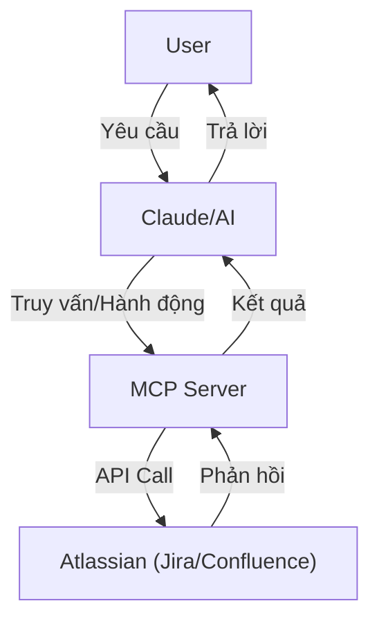
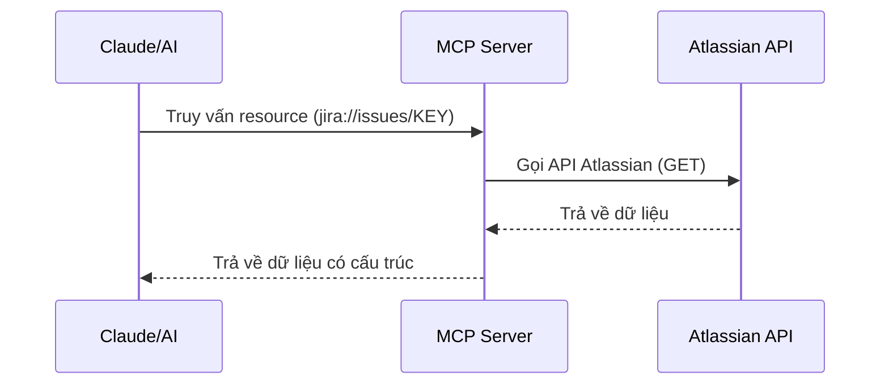
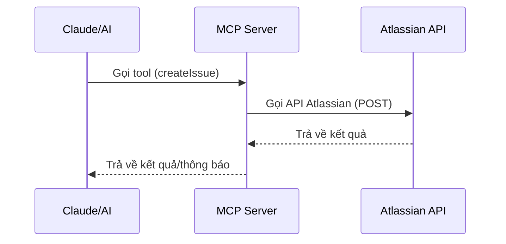
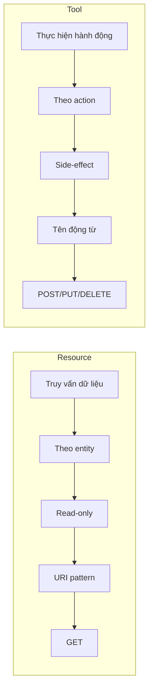

# Resource và Tool trong MCP Atlassian: Kiến trúc, Khái niệm và Best Practice

Tài liệu này mô tả hai thành phần chính trong Model Context Protocol (MCP) Atlassian Server: **Resource** và **Tool**. Chúng đóng vai trò quan trọng trong việc tương tác giữa AI và hệ thống Atlassian thông qua giao thức MCP.

## 1. Tổng quan

### Resource và Tool là gì?

- **Resource**: Là thành phần cung cấp *dữ liệu* cho AI. Tương tự như các API endpoint GET trong REST, resource chỉ đọc dữ liệu và không tạo side-effect.
  
- **Tool**: Là thành phần cho phép AI *thực hiện hành động* trên hệ thống. Tương tự như các API endpoint POST/PUT/DELETE trong REST, tool thay đổi trạng thái của hệ thống.

### Vai trò trong tương tác AI-Atlassian



## 2. Resource: Dữ liệu Có Cấu Trúc

### Đặc điểm chính

- **Entity-centric**: Tổ chức theo thực thể (projects, issues, users, pages...)
- **Read-only**: Không tạo side-effect, chỉ đọc dữ liệu
- **URI pattern**: Sử dụng mẫu URI nhất quán (`jira://issues/{issueKey}`)
- **Application-controlled**: API server quyết định dữ liệu nào được cung cấp

### Minh hoạ flow truy vấn Resource



### Ví dụ từ MCP Atlassian

| Resource | URI Pattern | Dữ liệu trả về |
|----------|-------------|----------------|
| Projects | `jira://projects` | Danh sách project (id, key, name, ...)|
| Project | `jira://projects/{projectKey}` | Thông tin project (id, key, name, description...) |
| Project Roles | `jira://projects/{projectKey}/roles` | Danh sách role của project |
| Issue | `jira://issues/{issueKey}` | Chi tiết issue (summary, status, assignee...) |
| Issues | `jira://issues` | Danh sách issues, hỗ trợ JQL, phân trang |
| Issue Transitions | `jira://issues/{issueKey}/transitions` | Danh sách transitions của issue |
| Comments | `jira://issues/{issueKey}/comments` | Comments của issue |
| User | `jira://users/{accountId}` | Thông tin chi tiết user |
| Assignable Users | `jira://users/assignable/{projectKey}` | Danh sách user có thể gán cho issue |
| Users by Role | `jira://users/role/{projectKey}/{roleId}` | Danh sách user theo role trong project |
| Confluence Spaces | `confluence://spaces` | Danh sách không gian Confluence |
| Confluence Space | `confluence://spaces/{spaceKey}` | Thông tin chi tiết không gian |
| Confluence Pages | `confluence://pages` | Danh sách trang Confluence |
| Confluence Page | `confluence://pages/{pageId}` | Thông tin chi tiết trang |
| Page Children | `confluence://pages/{pageId}/children` | Danh sách trang con |
| Page Ancestors | `confluence://pages/{pageId}/ancestors` | Danh sách tổ tiên của trang |

### Use cases đã kiểm thử

- **Truy vấn chi tiết**: Lấy thông tin chi tiết về một issue, project, user...
  ```
  jira://issues/XDEMO2-43
  ```

- **Truy vấn danh sách**: Lấy danh sách issues, projects, users...
  ```
  jira://issues
  ```

- **Truy vấn có filter**: Lọc dữ liệu theo điều kiện
  ```
  jira://issues?jql=project=XDEMO2
  ```

- **Truy vấn nested resource**: Lấy dữ liệu liên quan đến resource chính
  ```
  jira://issues/XDEMO2-43/transitions
  jira://issues/XDEMO2-43/comments
  ```

## 3. Tool: Thực Hiện Hành Động

### Đặc điểm chính

- **Action-centric**: Tổ chức theo hành động (create, update, transition, assign...)
- **Side-effect**: Thay đổi trạng thái hệ thống
- **Schema-driven**: Định nghĩa input/output schema rõ ràng
- **Model-controlled**: AI chủ động quyết định khi nào và cách nào gọi tool
- **User confirmation**: Thường yêu cầu xác nhận của người dùng

### Minh hoạ flow gọi Tool



### Ví dụ từ MCP Atlassian

| Tool | Mô tả | Tham số chính |
|------|-------|---------------|
| createIssue | Tạo issue mới | projectKey, summary, description... |
| updateIssue | Cập nhật issue | issueKey, summary, description... |
| transitionIssue | Chuyển trạng thái issue | issueKey, transitionId |
| assignIssue | Gán issue cho user | issueKey, accountId |
| createPage | Tạo trang Confluence | title, content, spaceKey |
| updatePage | Cập nhật trang Confluence | pageId, title, content |
| addComment | Thêm comment vào page | pageId, content |

### Use cases đã kiểm thử

- **Tạo mới**: Tạo issue mới, trang mới
  ```
  createIssue(projectKey: "XDEMO2", summary: "New task")
  ```

- **Cập nhật**: Thay đổi nội dung issue, page
  ```
  updateIssue(issueKey: "XDEMO2-43", summary: "Updated task", description: "New description")
  ```

- **Workflow**: Chuyển trạng thái issue
  ```
  transitionIssue(issueKey: "XDEMO2-43", transitionId: "51", comment: "Moving to To Do")
  ```

- **Gán**: Gán issue cho người dùng
  ```
  assignIssue(issueKey: "XDEMO2-43", accountId: "62e8c6c8c1b3a10ac3a9c03f")
  ```

## 4. Best Practice

### Resource

1. **URI pattern nhất quán**: Theo mô hình RESTful `{system}://{entity}[/{id}][/{sub-entity}]`
   ```
   jira://issues/DEMO-123
   confluence://pages/123456/children
   ```

2. **Phân cấp rõ ràng**: Resource con nằm dưới resource cha
   ```
   jira://projects/{projectKey}/issues
   jira://issues/{issueKey}/comments
   ```

3. **Query params tường minh**: Sử dụng query string cho filter, sort, paging
   ```
   jira://issues?jql=project=DEMO AND status="In Progress"
   jira://issues?startAt=0&maxResults=50
   ```

4. **Metadata đầy đủ**: Cung cấp thông tin về schema, mimeType cho client
   ```javascript
   {
     schema: {
       issue: {
         key: 'string',
         summary: 'string',
         description: 'string'
       }
     },
     mimeType: 'application/json'
   }
   ```

### Tool

1. **Tên tool là động từ hoặc cụm động từ**: Phản ánh rõ hành động
   ```
   createIssue, updatePage, assignIssue, transitionIssue
   ```

2. **Schema validation mạnh**: Định nghĩa rõ các tham số bắt buộc và tuỳ chọn
   ```javascript
   createIssueSchema = z.object({
     projectKey: z.string().describe('Mã dự án'),
     summary: z.string().describe('Tiêu đề issue'),
     description: z.string().optional().describe('Mô tả chi tiết')
   })
   ```

3. **Phản hồi rõ ràng**: Trả về kết quả cụ thể và thông báo thân thiện
   ```javascript
   {
     message: "Đã tạo issue thành công với key DEMO-123",
     data: {
       key: "DEMO-123",
       url: "https://yourcompany.atlassian.net/browse/DEMO-123"
     }
   }
   ```

4. **Chỉ dùng tool khi cần thay đổi dữ liệu**: Tránh dùng tool cho truy vấn

## 5. So sánh Resource và Tool



## 6. Bài học từ kiểm thử thực tế

- **Minimalism trong tham số**: Chỉ truyền tham số tối thiểu cần thiết (như trường hợp createIssue)
- **Xử lý ký tự đặc biệt**: Cẩn trọng với encode URI khi sử dụng ký tự đặc biệt trong JQL
- **Content phức tạp**: Đơn giản hóa nội dung HTML khi tạo trang hoặc comment
- **Phân biệt rõ read/write**: Chỉ dùng Resource cho đọc, Tool cho ghi

## 7. Tham khảo

- [Model Context Protocol - Resources Overview](https://modelcontextprotocol.io/docs/concepts/resources)
- [Model Context Protocol - Tools Overview](https://modelcontextprotocol.io/docs/concepts/tools)
- [Tài liệu nội bộ: So sánh Resource và Tool](../dev-guide/tool-vs-resource.md)
- [Báo cáo kiểm thử MCP Server Atlassian](../plan/test-report.md)

---

> "Resource là những gì hệ thống biết, Tool là những gì hệ thống có thể làm." 